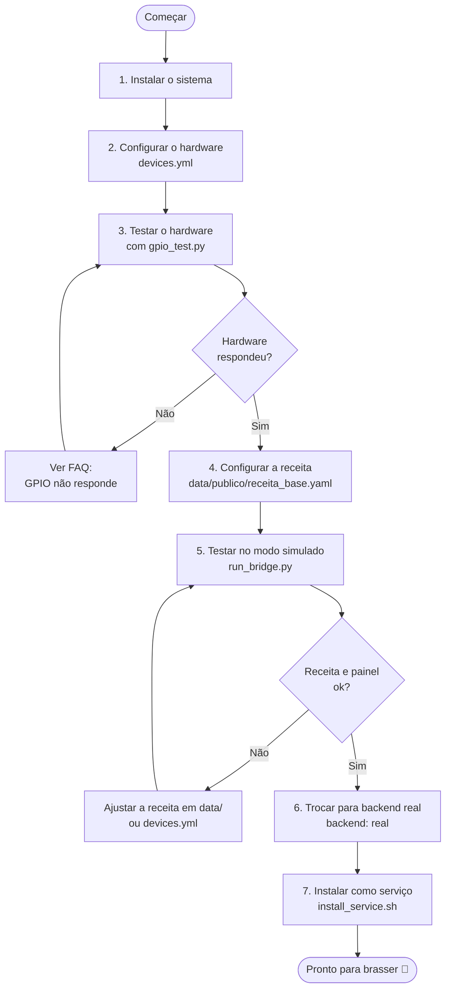

# 02 — Primeiros Passos

> **Navegação:** [Manual](01-introducao.md) | [Funcionalidades](03-funcionalidades.md) | [FAQ](04-perguntas-frequentes.md)

## O que você vai precisar

- Raspberry Pi com a placa de controle já conectada e cabeada ao equipamento (resistências, bombas, sensores de temperatura)
- Computador ou celular na mesma rede Wi-Fi que o Raspberry Pi
- Python 3.10 ou superior instalado no Pi

---

## Passo a passo — do zero à primeira brassagem



---

## 1. Instalar o sistema no Raspberry Pi

```bash
git clone https://github.com/ChristopherNicolasSMM/Tesseract-Device-Bridge.git
cd tesseract-device-bridge
pip install -r requirements.txt
```

---

## 2. Configurar o hardware (`devices.yml`)

```bash
cp devices.yml.example devices.yml
```

**Descobrir os endereços dos sensores DS18B20** (você precisa dessas informações para preencher o `devices.yml`):

```bash
python -m gpio.ds18b20_scan
```

Vai aparecer algo como:
```
28-0000071234ab  ->  GPIO 4
28-0000059876cd  ->  GPIO 4
```

Abra o `devices.yml` e substitua os valores de `address` pelos que o scan mostrou.

**Dica**: durante os primeiros testes, deixe `backend: simulated` — assim você pode usar o painel sem a placa ligada para verificar se a receita está configurada do jeito certo.

---

## 3. Testar o hardware antes de usar na brassagem

Este passo é importante e evita descobrir problemas no meio de uma brassagem. Troque para `backend: real` no `devices.yml` e rode a ferramenta de diagnóstico:

```bash
python tools/gpio_test.py
```

Escolha `[4] Informações do backend` primeiro — confirma qual biblioteca GPIO está sendo usada (deve aparecer `RPi.GPIO` no Raspbian).

Depois escolha `[2] Diagnóstico rápido` e teste os pinos `17,27,22,26` (os 4 atuadores padrão da MAZZA). Cada relé deve clicar fisicamente durante o teste.

Se os relés não responderem, veja a seção [FAQ — GPIO não responde](04-perguntas-frequentes.md#o-atuador-não-liga-mas-raspi-gpio-funciona).

---

## 4. Configurar a receita (`data/publico/receita_base.yaml`)

A receita "de fábrica" já vem em `data/publico/receita_base.yaml` — edite ela direto (é a única receita que **não** passa pelo sistema de cadastro, mas continua 100% selecionável pra brassar):

```bash
nano data/publico/receita_base.yaml
```

Os campos principais para editar:

```yaml
name: "Nome da sua receita"

vessels:
  - id: mash
    name: "Mostura"               # aparece na tela
    heater_device_id: mash_heater # mesmo id do devices.yml
    sensor_device_id: mash_tun_temp
    pid:
      kp: 5.0
      ki: 0.1
      kd: 0.0

steps:
  - vessel: mash
    label: "Sacarificação"        # aparece na timeline
    target_temp: 67               # temperatura alvo em °C
    hold_minutes: 60              # tempo de patamar
    pumps: [pump_b1]              # bomba ligada nesta etapa
    hop_alarms:
      - minutes_remaining: 60     # alerta quando faltam 60min para o fim da fervura
        label: "Lúpulo Amargor - 30g Magnum"
```

Para validar se a receita está correta:

```bash
python3 -c "
from config import BridgeConfig
import data
config = BridgeConfig.load('devices.yml')
recipe = data.load_recipe_by_id('publico:base', config)
print('OK:', recipe.name, recipe.step_count(), 'etapas')
"
```

Quiser cadastrar outras receitas (além da base)? Ver [FAQ — Como adiciono uma nova receita?](04-perguntas-frequentes.md#como-adiciono-uma-nova-receita).

---

## 5. Testar o painel

```bash
python run_bridge.py
```

Abra o navegador em `http://<ip-do-raspberry>:8088`.

Na aba **Painel**: verifique se os sensores estão mostrando temperaturas plausíveis. Na aba **Receitas**: confirme que as etapas aparecem na timeline corretamente.

---

## 6. Trocar para o hardware real

No `devices.yml`, mude:
```yaml
backend: simulated
```
para:
```yaml
backend: real
```

Reinicie o bridge com `CTRL+C` e `python run_bridge.py` novamente. Os sensores devem mostrar a temperatura ambiente real.

---

## 7. Instalar como serviço (recomendado para uso regular)

Isso faz o bridge iniciar automaticamente toda vez que o Pi ligar e abre um terminal com os logs ao vivo quando o desktop carregar:

```bash
sudo bash tools/install_service.sh
```

O script vai:
1. Detectar o usuário automaticamente e pedir confirmação
2. Instalar o serviço que inicia no boot
3. Perguntar se quer criar o terminal de logs automático (LXDE)

Para ver os logs depois:
```bash
bash tools/logs.sh
```

Para gerenciar o serviço:
```bash
sudo systemctl status  tesseract-bridge   # status
sudo systemctl restart tesseract-bridge   # reiniciar (após mudar configs)
sudo systemctl stop    tesseract-bridge   # parar
```

---

## 8. Configurar o som dos alarmes

Na aba Receitas, clique em **⚙️ Alarmes**.

- **Som**: Beep, Sirene, Campainha ou arquivo próprio (MP3, WAV, etc.)
- **Repetições**: quantas vezes o som toca antes de parar sozinho (1 a 20)

Clique em **Testar som** para ouvir. As configurações ficam salvas no navegador — não precisa refazer toda vez.
