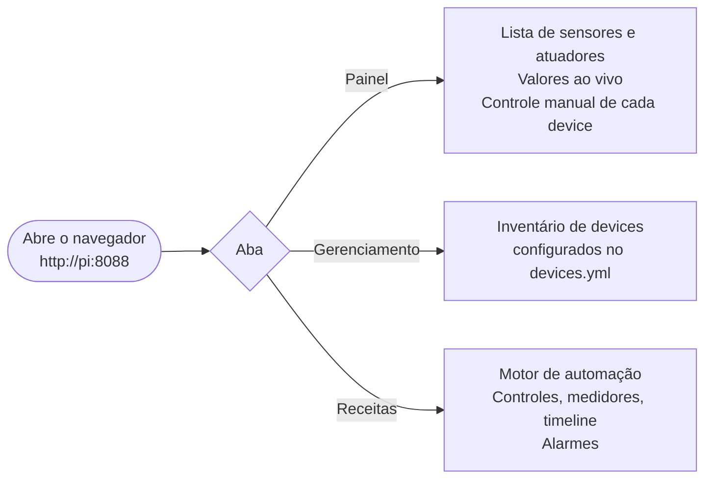

# 03 — Funcionalidades

> **Navegação:** [Manual](01-introducao.md) | [Primeiros Passos](02-primeiros-passos.md) | [FAQ](04-perguntas-frequentes.md)

## Visão geral do painel



---

## Aba Painel

Lista todos os sensores e atuadores com atualização automática a cada poucos segundos.

**Sensores** mostram o valor atual em tempo real (temperatura em °C).

**Atuadores** têm um botão de controle manual — útil para testar antes de uma brassagem ou acionar algo pontualmente. ⚠️ Se uma receita estiver rodando, o controle manual e o motor de receita podem entrar em conflito no mesmo atuador. Use só quando a receita não estiver ativa naquele equipamento.

---

## Aba Gerenciamento

Tabela com inventário completo dos devices configurados: nome, tipo, subtipo, pinos e tópicos MQTT. Útil para confirmar que o `devices.yml` foi carregado corretamente.

---

## Aba Receitas

### Status da receita

| Etiqueta | Cor | Significado |
|---|---|---|
| Parada | Cinza | Receita ainda não foi iniciada |
| Subindo | Âmbar | Aquecendo até a temperatura alvo |
| Em patamar | Verde | Alvo atingido, contando o tempo |
| Pausada | Cinza | Pausada manualmente pelo operador |
| Pausada (queda) | Vermelho | Pi reiniciou no meio da execução |
| Concluída | Verde | Todas as etapas terminaram |
| Cancelada | Cinza | Cancelada manualmente |

### Barra de controles e cronômetro


| Botão | Ação |
|---|---|
| `⏮` | Volta para a etapa anterior (reinicia ela do zero); na primeira etapa, reinicia a atual |
| `↺` | Reinicia a etapa atual sem mudar de posição na receita |
| `⏯` | Inicia se parado, pausa se rodando, retoma se pausado |
| `⏭` | Força avanço para a próxima etapa ignorando temperatura e tempo |

**Cronômetro grande**:
- Durante **subida**: tempo decorrido desde o início da rampa
- Durante **patamar**: tempo **restante** até o fim do patamar (contagem regressiva)
- Pausado ou parado: mensagem contextual

**Linha de tempo total**: tempo decorrido desde o início / tempo previsto total (soma dos patamares).

### Medidores de vasilha

Um medidor circular por vasilha. O **anel cobre** preenche conforme a potência aplicada — dado real do controlador PID, não decoração. Anel cheio = aquecendo a 100% de potência; anel vazio = aquecedor desligado.

Na vasilha ativa:
- Temperatura atual no centro do anel
- Temperatura alvo e indicador da bomba ligada

Vasilhas fora da etapa atual ficam acinzentadas com "aguardando".

### Timeline de etapas

Barra horizontal com uma bolinha por etapa. Etapas concluídas ficam em cobre sólido; a atual fica destacada (âmbar durante subida, verde durante patamar). Futuras mostram o alvo e o tempo de patamar.

### Gráfico ao vivo

Temperatura real (linha cobre sólida) vs. setpoint (linha tracejada cinza) dos últimos ~6 minutos. Reinicia quando avança para uma nova vasilha.

---

## Alarmes

### Tipos de alarme

| Tipo | Quando dispara |
|---|---|
| Início de vasilha | Quando começa a trabalhar em uma vasilha (no início e em cada troca) |
| Final de vasilha | Quando termina todas as etapas de uma vasilha |
| Adição programada | Nos momentos configurados em `hop_alarms` da etapa |

### Banner de alarme

Quando um alarme dispara, um **banner âmbar pulsante** aparece no topo da aba Receitas com o texto e um botão **OK**. Um som também toca.

Se houver mais de um alarme pendente, aparece o contador "+ N alarme(s) na fila" — eles são exibidos um por vez em ordem.

Clique **OK** para confirmar e avançar para o próximo.

### Configuração de som

Botão **⚙️ Alarmes** no cabeçalho da receita:

| Opção | Descrição |
|---|---|
| Beep simples | Curto e discreto |
| Sirene | Dois tons alternados, mais chamativo |
| Campainha dupla | Dois bipes seguidos |
| Som personalizado | Upload de arquivo (MP3, WAV, OGG). Salvo no navegador. |

**Repetições**: o som toca N vezes (1-20) e para sozinho, OU para ao clicar em OK — o que vier primeiro.

---

## Recuperação após queda de energia

Se o Pi reiniciar no meio de uma brassagem, o sistema:
1. Detecta o crash automaticamente ao iniciar
2. Desliga todos os aquecedores e bombas (failsafe)
3. Exibe um **banner vermelho** com botão "Retomar"

**Antes de clicar Retomar**: verifique fisicamente se o equipamento está em condições seguras de continuar. O sistema **nunca retoma sozinho**.

Se a queda ocorreu durante um patamar, o tempo já decorrido é preservado — você não perde os minutos que passaram antes da queda.

---

## Logs do sistema

Se o bridge estiver rodando como serviço (ver [Primeiros Passos — instalar como serviço](02-primeiros-passos.md#7-instalar-como-serviço-recomendado-para-uso-regular)), os logs aparecem coloridos:

```
[14:32:07] INFO   bridge: Motor de receita ativo (status: idle)
[14:32:09] WARN   gpio.real: backend selecionado: RPi.GPIO
[14:32:10] ERROR  recipe_engine.engine: Erro ao carregar receita
```

Para ver ao vivo:
```bash
bash tools/logs.sh
```

Com desktop LXDE instalado (via `install_service.sh`), um terminal de logs abre automaticamente quando o Pi liga.

---

## Gerenciamento do serviço

```bash
sudo systemctl status  tesseract-bridge   # está rodando?
sudo systemctl restart tesseract-bridge   # reiniciar (após mudar configs)
sudo systemctl stop    tesseract-bridge   # parar temporariamente
sudo systemctl start   tesseract-bridge   # iniciar manualmente
```

Após editar `devices.yml` ou `recipe.yml`, o serviço precisa ser reiniciado — o bridge carrega as configurações apenas ao iniciar.
