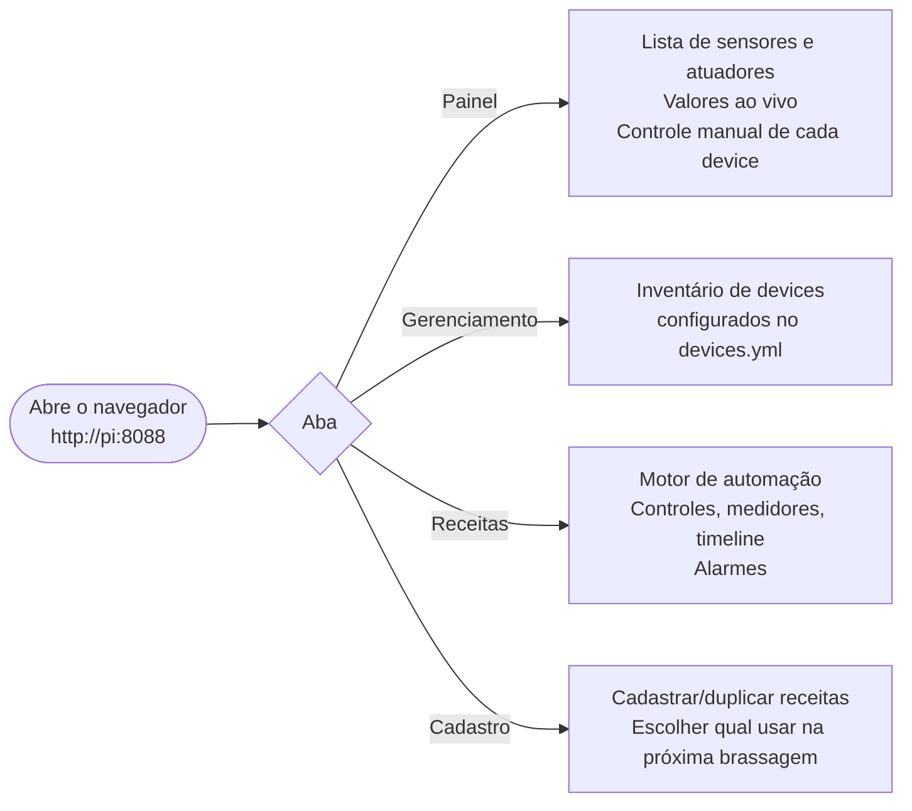
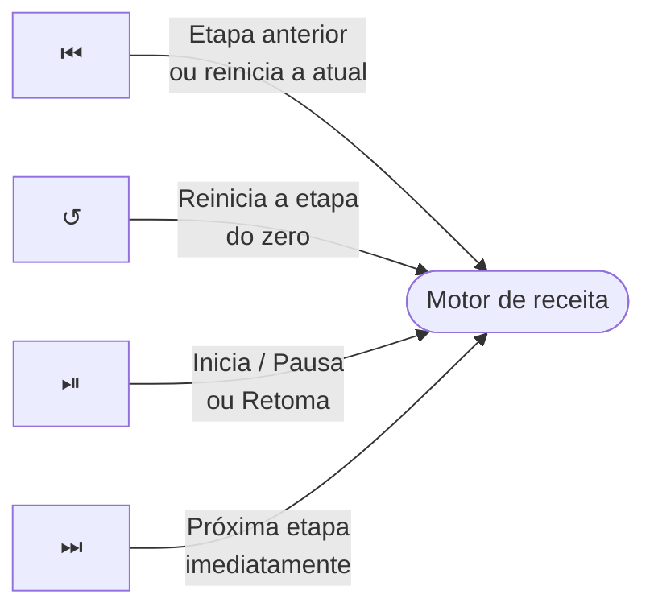

# 03 — Funcionalidades

> **Navegação:** [Manual](01-introducao.md) | [Primeiros Passos](02-primeiros-passos.md) | [FAQ](04-perguntas-frequentes.md)

## Visão geral do painel



---

## Aba Painel

Lista todos os sensores e atuadores com atualização automática a cada poucos segundos.

**Sensores** mostram o valor atual em tempo real (temperatura em °C).

**Atuadores simples** (bombas, válvulas) têm um interruptor Ligado/Desligado.

**Atuadores com controle de potência** (resistências com SSR — mostura, fervura) têm um **interruptor Ligado/Desligado separado de um slider de 0-100%**: ajustar o slider sozinho nunca liga a resistência — precisa do interruptor estar explicitamente ligado. Abaixo do slider, um texto mostra o que está de fato sendo aplicado no momento (ex.: "Aplicado: 🌡️ Receita (PID) (60%)" ou "Aplicado: 🖐️ Manual (40%)").

Um comando manual sempre tem prioridade sobre uma receita ativa no mesmo atuador — não há mais risco de conflito entre os dois. Um failsafe (queda de energia, perda de conexão) sempre vence qualquer controle manual, mesmo assim.

---

## Aba Gerenciamento

Tabela com inventário completo dos devices configurados: nome, tipo, subtipo, pinos e tópicos MQTT. Útil para confirmar que o `devices.yml` foi carregado corretamente.

---

## Aba Receitas

### Status da receita

| Etiqueta | Cor | Significado |
|---|---|---|
| Parada | Cinza | Receita ainda não foi iniciada |
| Subindo | Âmbar | Aquecendo até a temperatura alvo |
| Em patamar | Verde | Alvo atingido, contando o tempo |
| Pausada | Cinza | Pausada manualmente pelo operador |
| Pausada (queda) | Vermelho | Pi reiniciou no meio da execução |
| Concluída | Verde | Todas as etapas terminaram |
| Cancelada | Cinza | Cancelada manualmente |

### Barra de controles e cronômetro



| Botão | Ação |
|---|---|
| `⏮` | Volta para a etapa anterior (reinicia ela do zero); na primeira etapa, reinicia a atual |
| `↺` | Reinicia a etapa atual sem mudar de posição na receita |
| `⏯` | Inicia se parado, pausa se rodando, retoma se pausado |
| `⏭` | Força avanço para a próxima etapa ignorando temperatura e tempo |

**Cronômetro grande**:
- Durante **subida**: tempo decorrido desde o início da rampa
- Durante **patamar**: tempo **restante** até o fim do patamar (contagem regressiva)
- Pausado ou parado: mensagem contextual

**Linha de tempo total**: tempo decorrido desde o início / tempo previsto total (soma dos patamares).

### Medidores de vasilha

Um medidor circular por vasilha. O **anel cobre** preenche conforme a potência aplicada — dado real, seja da receita (PID) ou de um controle manual ativo, não decoração. Anel cheio = aquecendo a 100% de potência; anel vazio = aquecedor desligado.

Abaixo do medidor, cada vasilha tem seu próprio **interruptor Ligado/Desligado + slider de %** (mesmo controle da Aba Painel, só que sem precisar sair da tela da receita) e, quando a vasilha tem bomba associada, um **subcard de bomba** por bomba:

- Botão redondo com ícone: ▶ quando desligada (toque para ligar), ⏹ quando ligada (toque para parar) — sempre assume controle manual.
- Badge indicando o modo atual: 🤖 Receita (controlada automaticamente pela etapa em andamento) ou 🖐️ Manual (você assumiu o controle).
- Quando em modo manual, um botão pequeno ↺ aparece para devolver o controle pra receita.

Um override manual (de heater ou de bomba) continua valendo mesmo se a receita avançar de etapa — só é liberado quando você clica em ↺ (ou desliga o interruptor), nunca sozinho.

### Confirmação de bomba automática

Na primeira vez que a receita quiser ligar uma bomba automaticamente **nesta execução**, ela não liga sozinha — aparece um aviso âmbar no topo da receita, e o subcard da bomba fica pulsando com dois botões: **Confirmar** (deixa a receita controlar essa bomba dali em diante, sem perguntar de novo) ou **Manter manual** (a receita nunca liga essa bomba sozinha; se quiser, você liga na mão pelo próprio subcard).

Isso existe pra evitar ligar uma bomba com a conexão fechada ou errada sem ninguém checar antes. A confirmação vale pro resto da execução (mesmo trocando de etapa) — mas se você pausar/retomar manualmente, continua valendo; já um reinício do processo (queda de energia) pede confirmação de novo, por segurança.

Vasilhas fora da etapa atual ficam acinzentadas com "aguardando" no alvo — mas o medidor de potência e os controles manuais funcionam normalmente em qualquer vasilha, ativa ou não.

### Timeline de etapas

Barra horizontal com uma bolinha por etapa. Etapas concluídas ficam em cobre sólido; a atual fica destacada (âmbar durante subida, verde durante patamar). Futuras mostram o alvo e o tempo de patamar.

### Gráfico ao vivo

Temperatura real (linha cobre sólida) vs. setpoint (linha tracejada cinza) dos últimos ~6 minutos. Reinicia quando avança para uma nova vasilha.

---

## Aba Cadastro

Onde você cadastra receitas novas e escolhe qual vai rodar na próxima brassagem — sem editar arquivo na mão.

### Toda receita nova parte de uma existente

Não existe "começar do zero". Cada receita cadastrada tem um botão **🧬 Duplicar** — clique nele, o sistema copia tudo (inclusive as vasilhas, que são configuração de equipamento físico, não do processo) e abre um formulário já pronto pra você editar só o que muda de fato entre receitas: as **etapas** (temperatura alvo, tempo de patamar, quais bombas ligam, alarmes de lúpulo).

As vasilhas ficam escondidas num bloco recolhido **⚙️ Vasilhas (avançado)** — a maioria das pessoas nunca precisa abrir isso. Se abrir, só os ganhos do PID (Kp/Ki/Kd) são editáveis por ali; trocar qual sensor/aquecedor uma vasilha usa é tarefa rara o bastante pra exigir editar o arquivo diretamente.

### Público ou privado

Ao salvar, você escolhe:
- **🔒 Privada** — fica só nesta máquina, nunca é compartilhada.
- **🌐 Pública** — vai pro repositório do projeto (se você usa Git pra sincronizar entre máquinas ou compartilhar com outras pessoas).

### Cada card de receita mostra

| Badge | Significado |
|---|---|
| 🌐 Pública / 🔒 Privada | Onde está salva |
| 🔐 Base (não editável) | É a `receita_base.yaml` — pode ser selecionada e duplicada, mas não editada nem apagada por aqui |
| 🟢 Rodando agora | É a receita que o bridge está executando neste momento |
| ⏳ Vai rodar no próximo restart | Foi marcada como ativa, mas o bridge ainda não foi reiniciado pra aplicar |
| ⚠️ Inválida | Referencia um device que não existe mais no `devices.yml` — o erro exato aparece no card |

Botão **▶ Usar esta** marca a receita como ativa pro próximo boot do bridge — **não troca a receita rodando agora**, precisa reiniciar o processo pra valer (mesma regra de sempre: `sudo systemctl restart tesseract-bridge`).

---

## Alarmes

### Tipos de alarme

| Tipo | Quando dispara |
|---|---|
| Início de vasilha | Quando começa a trabalhar em uma vasilha (no início e em cada troca) |
| Final de vasilha | Quando termina todas as etapas de uma vasilha |
| Adição programada | Nos momentos configurados em `hop_alarms` da etapa |

### Banner de alarme

Quando um alarme dispara, um **banner âmbar pulsante** aparece no topo da aba Receitas com o texto e um botão **OK**. Um som também toca.

Se houver mais de um alarme pendente, aparece o contador "+ N alarme(s) na fila" — eles são exibidos um por vez em ordem.

Clique **OK** para confirmar e avançar para o próximo.

### Configuração de som

Botão **⚙️ Alarmes** no cabeçalho da receita:

| Opção | Descrição |
|---|---|
| Beep simples | Curto e discreto |
| Sirene | Dois tons alternados, mais chamativo |
| Campainha dupla | Dois bipes seguidos |
| Som personalizado | Upload de arquivo (MP3, WAV, OGG). Salvo no navegador. |

**Repetições**: o som toca N vezes (1-20) e para sozinho, OU para ao clicar em OK — o que vier primeiro.

---

## Recuperação após queda de energia

Se o Pi reiniciar no meio de uma brassagem, o sistema:
1. Detecta o crash automaticamente ao iniciar
2. Desliga todos os aquecedores e bombas (failsafe)
3. Exibe um **banner vermelho** com botão "Retomar"

**Antes de clicar Retomar**: verifique fisicamente se o equipamento está em condições seguras de continuar. O sistema **nunca retoma sozinho**.

Se a queda ocorreu durante um patamar, o tempo já decorrido é preservado — você não perde os minutos que passaram antes da queda.

---

## Logs do sistema

Se o bridge estiver rodando como serviço (ver [Primeiros Passos — instalar como serviço](02-primeiros-passos.md#7-instalar-como-serviço-recomendado-para-uso-regular)), os logs aparecem coloridos:

```
[14:32:07] INFO   bridge: Motor de receita ativo (status: idle)
[14:32:09] WARN   gpio.real: backend selecionado: RPi.GPIO
[14:32:10] ERROR  recipe_engine.engine: Erro ao carregar receita
```

Para ver ao vivo:
```bash
bash tools/logs.sh
```

Com desktop LXDE instalado (via `install_service.sh`), um terminal de logs abre automaticamente quando o Pi liga.

---

## Gerenciamento do serviço

```bash
sudo systemctl status  tesseract-bridge   # está rodando?
sudo systemctl restart tesseract-bridge   # reiniciar (após mudar configs)
sudo systemctl stop    tesseract-bridge   # parar temporariamente
sudo systemctl start   tesseract-bridge   # iniciar manualmente
```

Após editar `devices.yml` ou `recipe.yml`, o serviço precisa ser reiniciado — o bridge carrega as configurações apenas ao iniciar.
