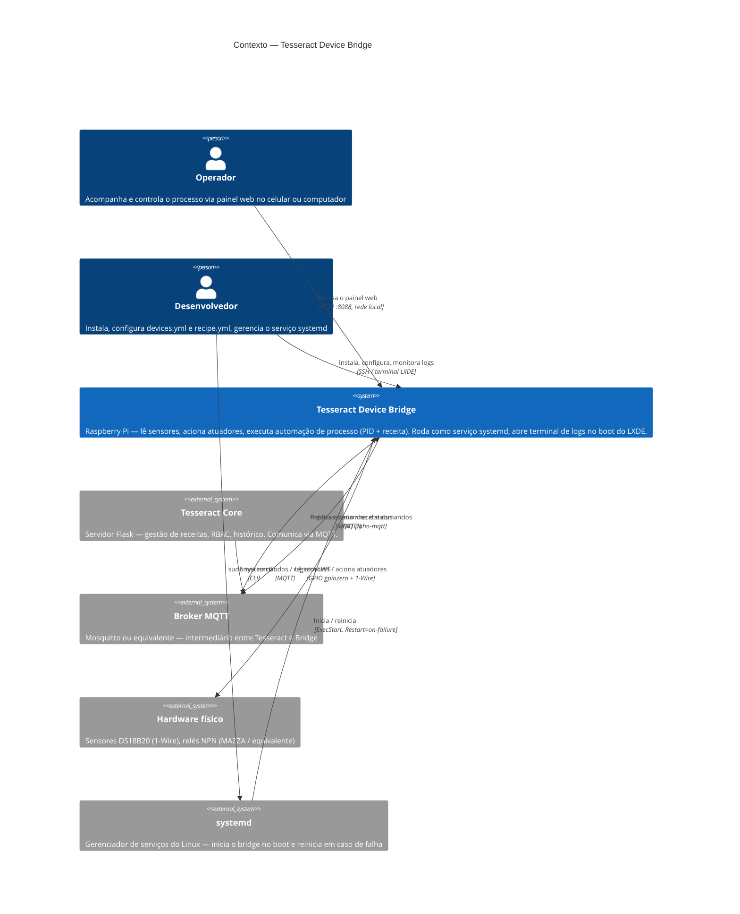
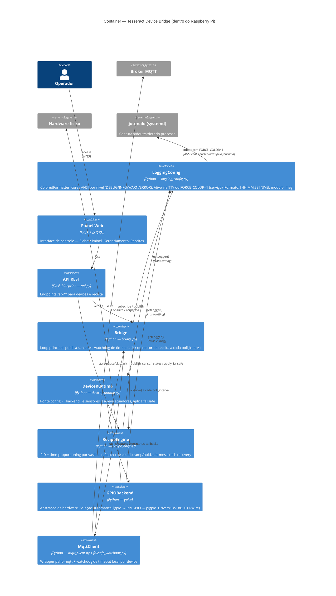
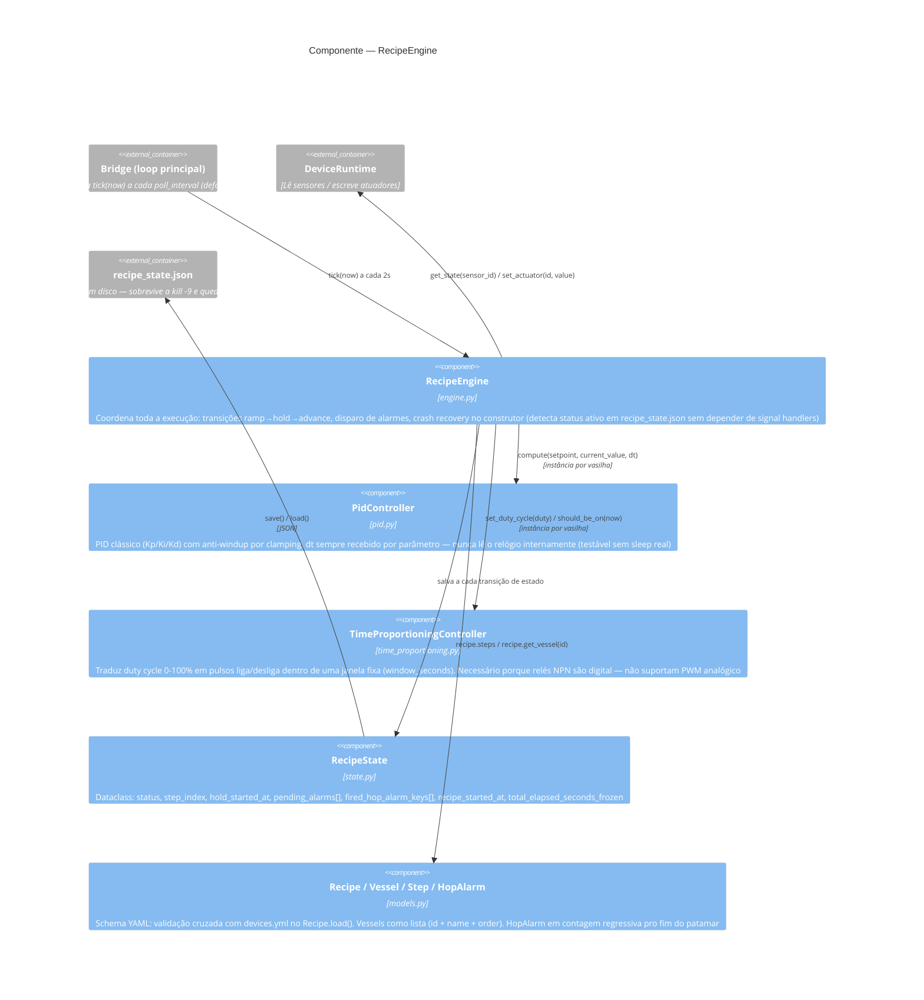
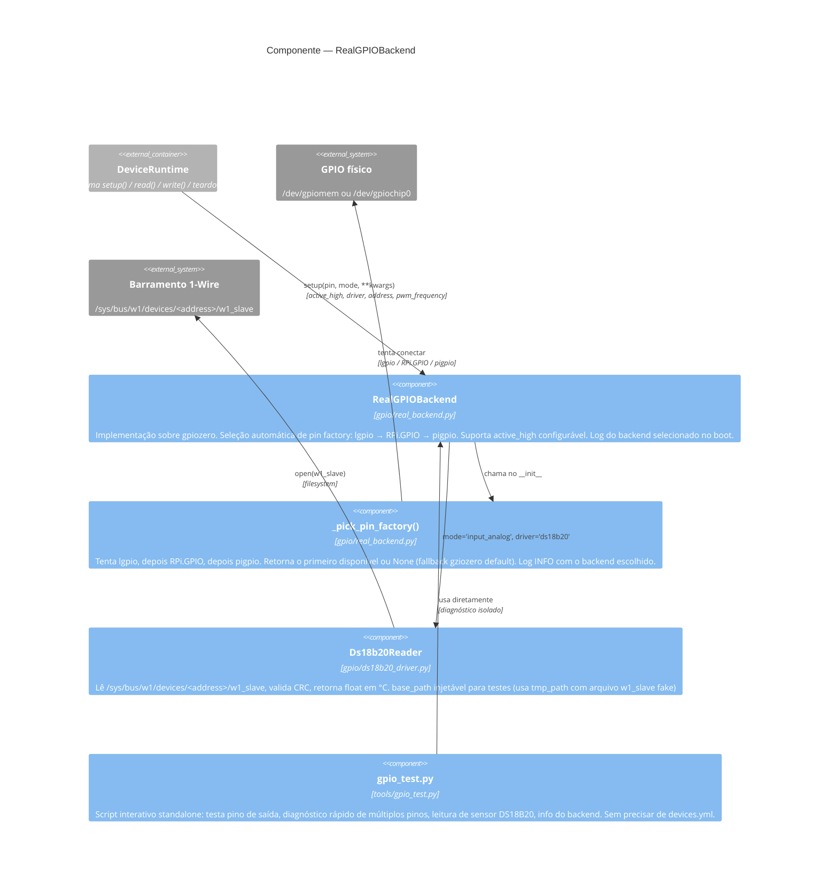

# 02 — Diagramas C4

> **Navegação:** [Visão Geral](01-visao-geral.md) | [Fluxos](03-fluxos.md) | [Modelo de Dados](04-modelo-de-dados.md) | [Casos de Uso](05-casos-de-uso.md) | [Manutenção](06-manutencao-e-expansao.md)

## Nível 1 — Contexto

Mostra os atores externos e como o bridge se encaixa no ecossistema.

## Nível 2 — Container

Mostra os componentes internos do bridge e suas responsabilidades.

## Nível 3 — Componente: RecipeEngine

Zoom no componente de maior complexidade interna.

## Nível 3 — Componente: GPIOBackend (real)

Zoom na seleção de backend e driver de sensor.

