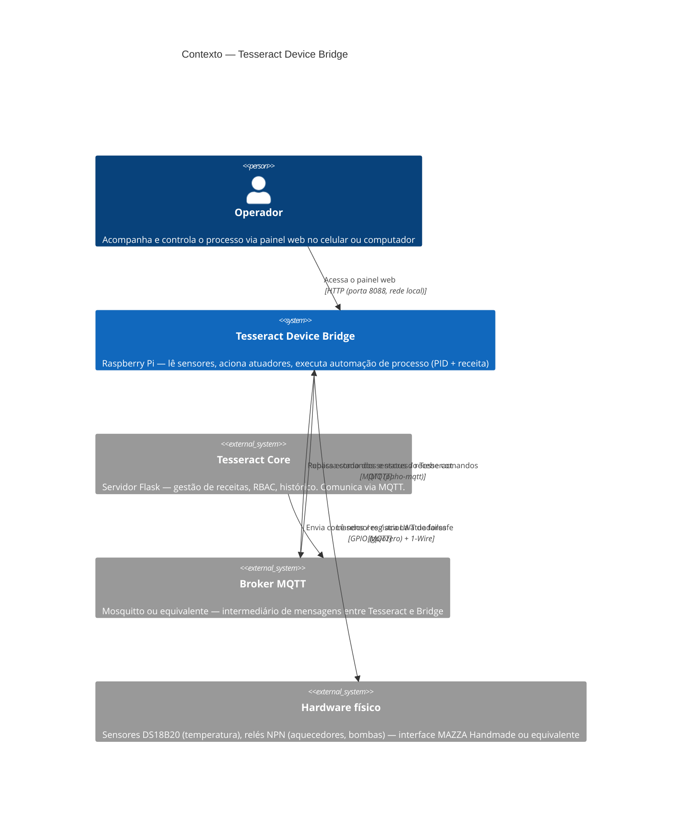
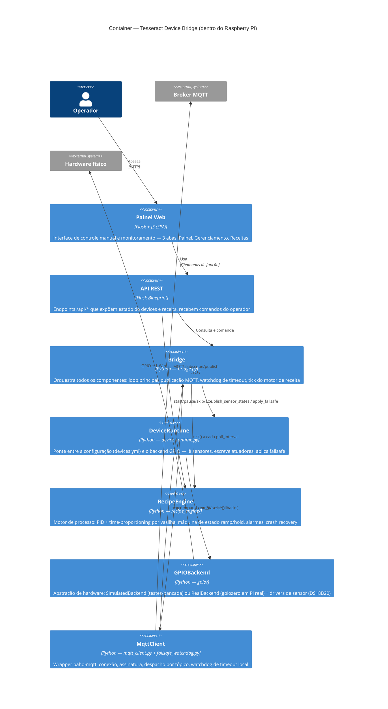
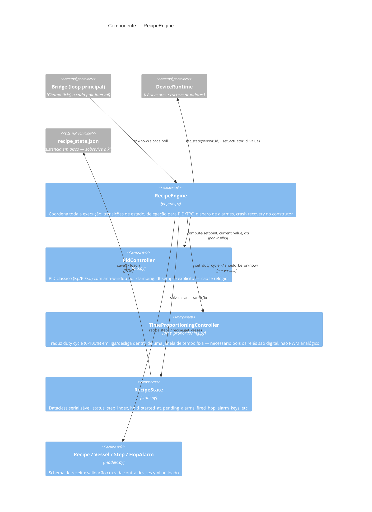

# 02 — Diagrama C4

## Nível 1 — Contexto

Mostra os atores externos que interagem com o bridge e como ele se encaixa
no ecossistema maior.

## Nível 2 — Container

Mostra os componentes internos do bridge e como se relacionam.

## Nível 3 — Componente (RecipeEngine)

Zoom no componente mais complexo — o motor de processo.

