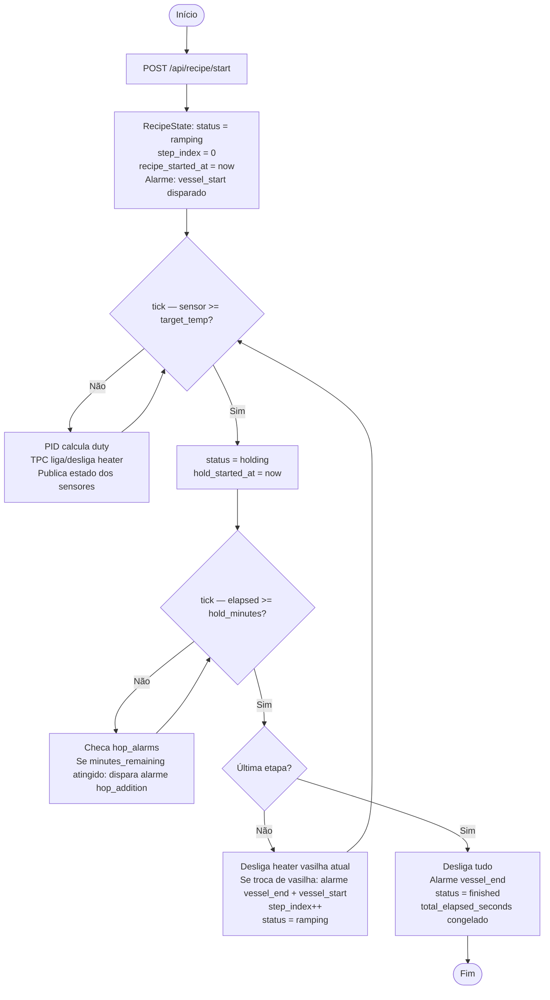
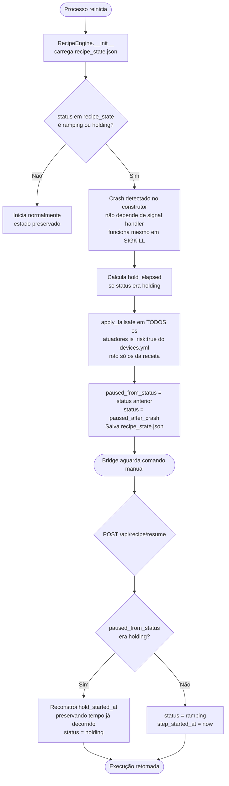
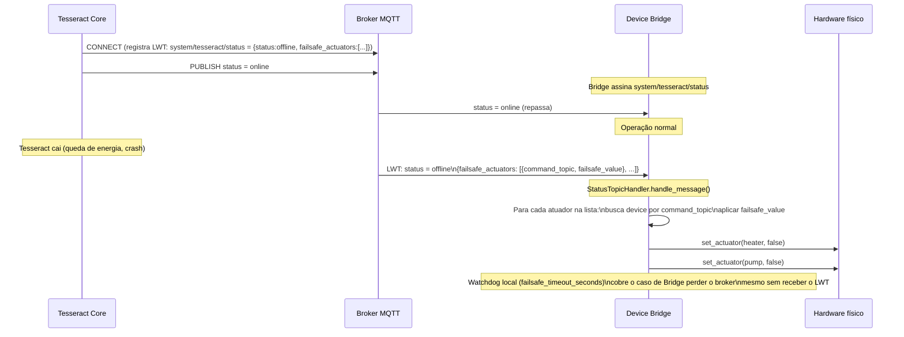
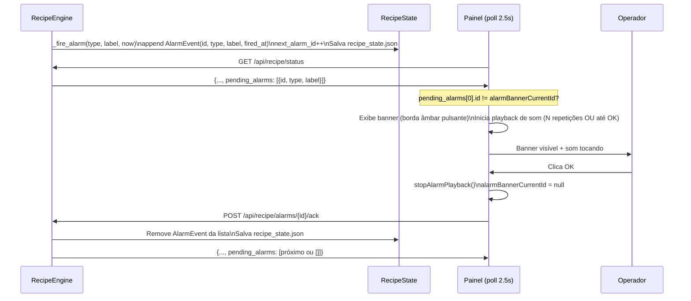

# 03 — Fluxos de Execução

## Fluxo 1 — Execução de receita (caminho feliz)

```mermaid
flowchart TD
    A([Início]) --> B[POST /api/recipe/start]
    B --> C[RecipeState: status = ramping\nstep_index = 0\nrecipe_started_at = now\nAlarme: vessel_start disparado]
    C --> D{tick — sensor >= target_temp?}
    D -- Não --> E[PID calcula duty\nTPC liga/desliga heater\nPublica estado dos sensores]
    E --> D
    D -- Sim --> F[status = holding\nhold_started_at = now]
    F --> G{tick — elapsed >= hold_minutes?}
    G -- Não --> H[Checa hop_alarms\nSe minutes_remaining atingido: dispara alarme hop_addition]
    H --> G
    G -- Sim --> I{Última etapa?}
    I -- Não --> J[Desliga heater vasilha atual\nSe troca de vasilha: alarme vessel_end + vessel_start\nstep_index++\nstatus = ramping]
    J --> D
    I -- Sim --> K[Desliga tudo\nAlarme vessel_end\nstatus = finished\ntotal_elapsed_seconds congelado]
    K --> L([Fim])
```

## Fluxo 2 — Recuperação de crash

```mermaid
flowchart TD
    A([Processo reinicia]) --> B[RecipeEngine.__init__\ncarrega recipe_state.json]
    B --> C{status em recipe_state\né ramping ou holding?}
    C -- Não --> D[Inicia normalmente\nestado preservado]
    C -- Sim --> E[Crash detectado no construtor\nnão depende de signal handler\nfunciona mesmo em SIGKILL]
    E --> F[Calcula hold_elapsed\nse status era holding]
    F --> G[apply_failsafe em TODOS os\natuadores is_risk:true do devices.yml\nnão só os da receita]
    G --> H[paused_from_status = status anterior\nstatus = paused_after_crash\nSalva recipe_state.json]
    H --> I([Bridge aguarda comando manual])
    I --> J{POST /api/recipe/resume}
    J --> K{paused_from_status\nera holding?}
    K -- Sim --> L[Reconstrói hold_started_at\npreservando tempo já decorrido\nstatus = holding]
    K -- Não --> M[status = ramping\nstep_started_at = now]
    L --> N([Execução retomada])
    M --> N
```

## Fluxo 3 — Failsafe MQTT

```mermaid
sequenceDiagram
    participant T as Tesseract Core
    participant B as Broker MQTT
    participant D as Device Bridge
    participant H as Hardware físico

    T->>B: CONNECT (registra LWT: system/tesseract/status = {status:offline, failsafe_actuators:[...]})
    T->>B: PUBLISH status = online

    Note over D: Bridge assina system/tesseract/status

    B->>D: status = online (repassa)
    Note over D: Operação normal

    Note over T: Tesseract cai (queda de energia, crash)
    B->>D: LWT: status = offline\n{failsafe_actuators: [{command_topic, failsafe_value}, ...]}

    Note over D: StatusTopicHandler.handle_message()
    D->>D: Para cada atuador na lista:\nbusca device por command_topic\naplicar failsafe_value

    D->>H: set_actuator(heater, false)
    D->>H: set_actuator(pump, false)

    Note over D: Watchdog local (failsafe_timeout_seconds)\ncobre o caso de Bridge perder o broker\nmesmo sem receber o LWT
```

## Fluxo 4 — Ciclo de alarme

```mermaid
sequenceDiagram
    participant E as RecipeEngine
    participant S as RecipeState
    participant P as Painel (poll 2.5s)
    participant U as Operador

    E->>S: _fire_alarm(type, label, now)\nappend AlarmEvent(id, type, label, fired_at)\nnext_alarm_id++\nSalva recipe_state.json

    P->>E: GET /api/recipe/status
    E->>P: {..., pending_alarms: [{id, type, label}]}

    Note over P: pending_alarms[0].id != alarmBannerCurrentId?
    P->>P: Exibe banner (borda âmbar pulsante)\nInicia playback de som (N repetições OU até OK)
    P->>U: Banner visível + som tocando

    U->>P: Clica OK
    P->>P: stopAlarmPlayback()\nalarmBannerCurrentId = null
    P->>E: POST /api/recipe/alarms/{id}/ack
    E->>S: Remove AlarmEvent da lista\nSalva recipe_state.json
    E->>P: {..., pending_alarms: [próximo ou []]}
```
