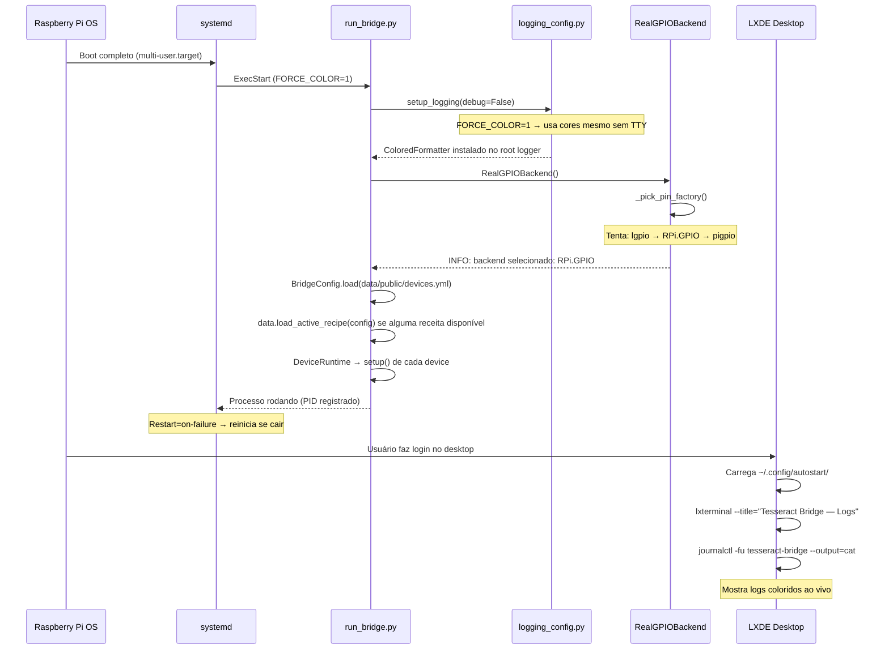
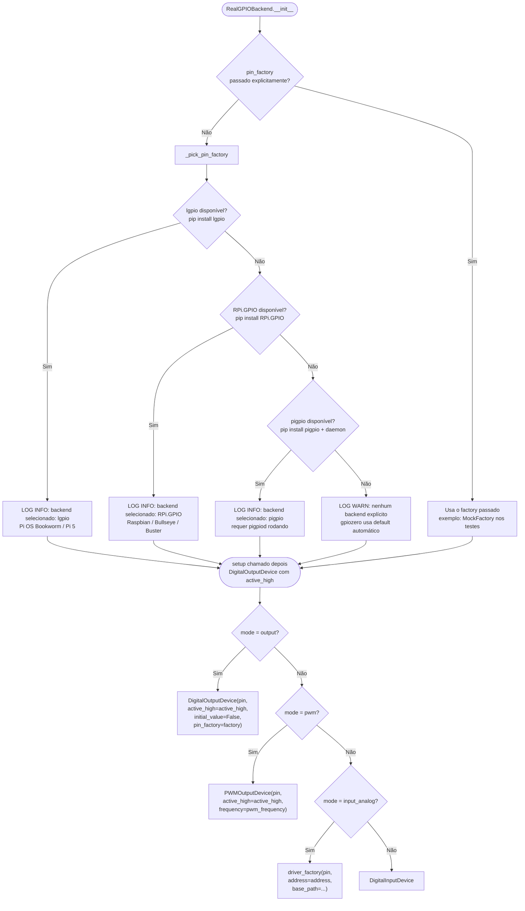
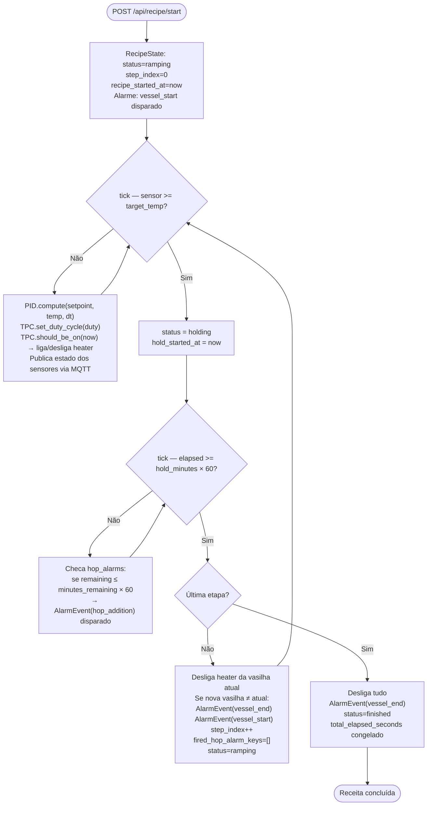
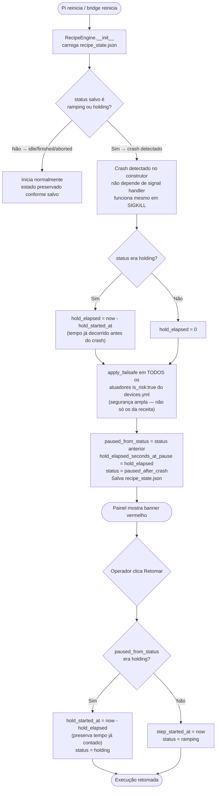
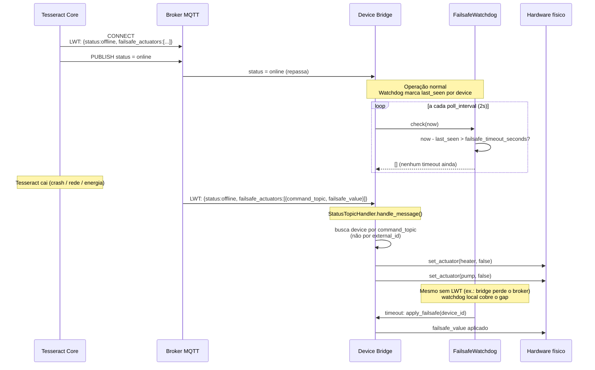
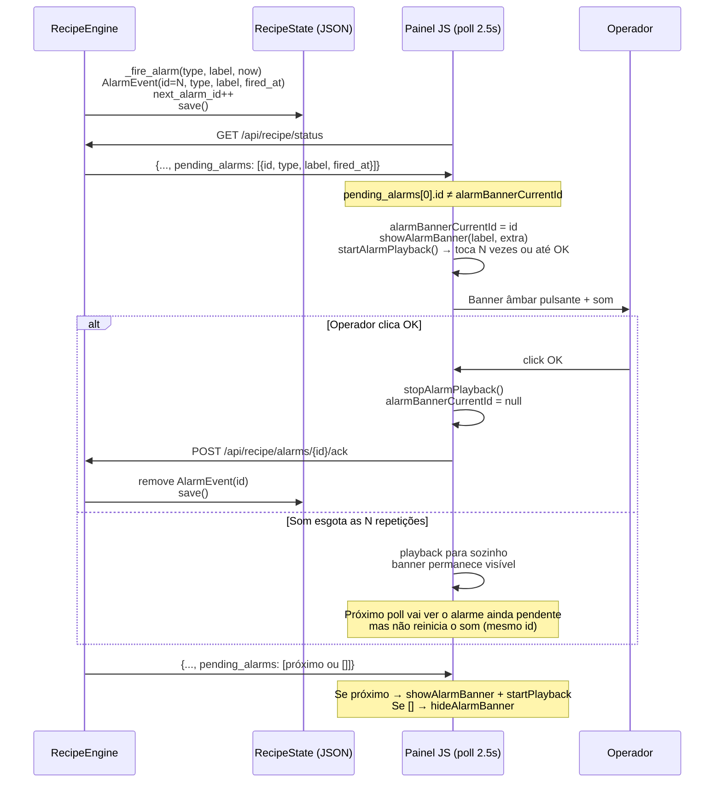
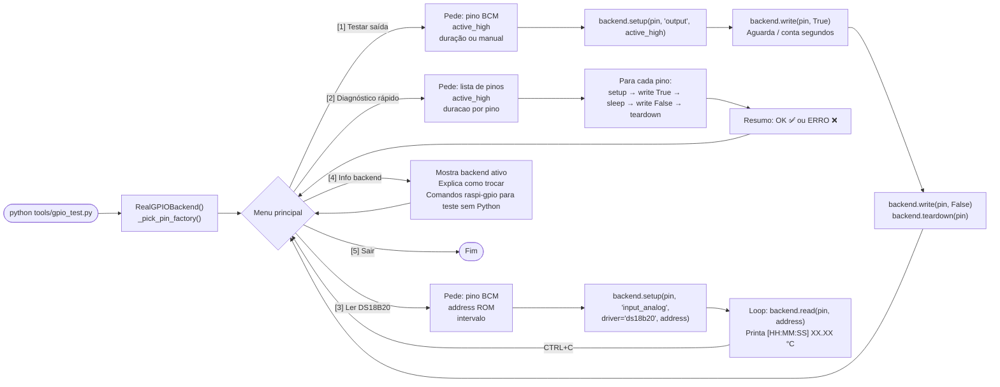
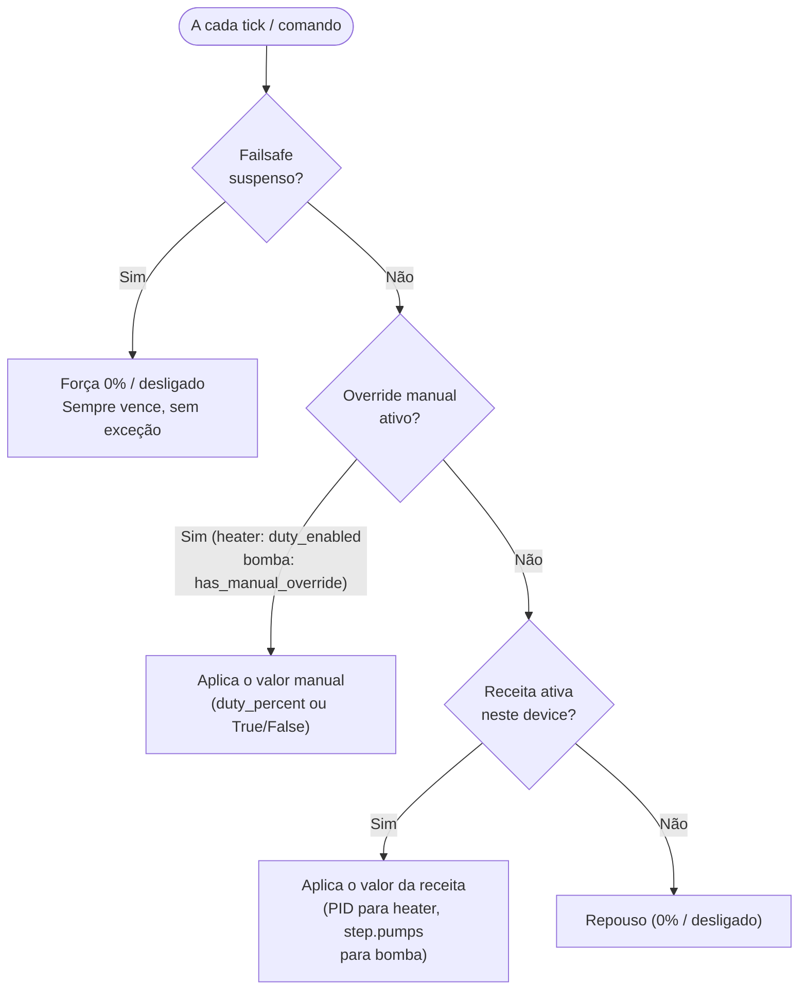
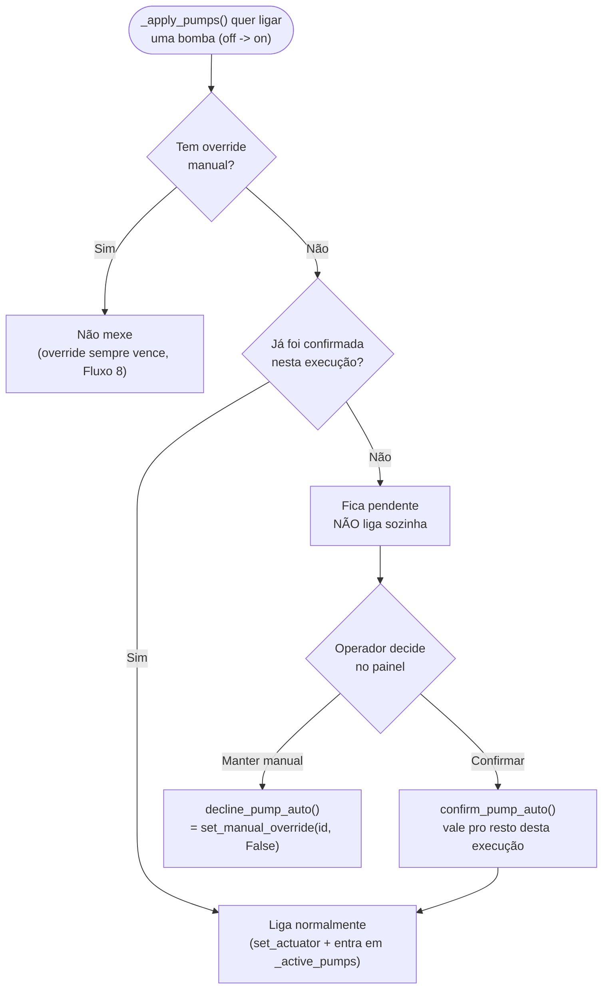

# 03 — Fluxos de Execução

> **Navegação:** [Visão Geral](01-visao-geral.md) | [C4 Diagrams](02-diagrama-c4.md) | [Modelo de Dados](04-modelo-de-dados.md) | [Casos de Uso](05-casos-de-uso.md) | [Manutenção](06-manutencao-e-expansao.md)

## Fluxo 1 — Boot do serviço systemd e seleção de backend GPIO

Mostra o que acontece desde o boot do Pi até o bridge estar pronto para receber comandos.

## Fluxo 2 — Seleção de backend GPIO (detalhe)

## Fluxo 3 — Execução de receita (caminho feliz)

## Fluxo 4 — Recuperação de crash (queda de energia / kill -9)

## Fluxo 5 — Failsafe MQTT (Tesseract Core cai)

## Fluxo 6 — Ciclo de alarme (disparo → som → confirmação)

## Fluxo 7 — Diagnóstico GPIO com gpio_test.py

## Fluxo 8 — Prioridade de controle de um atuador (failsafe > manual > receita > repouso)

`DeviceRuntime` é o dono único da escrita física em qualquer atuador que
o `RecipeEngine` também gerencia (heaters com `hardware.window_seconds`
via `tick_duty()`; bombas via `_apply_pumps()`) — nenhum dos dois
escreve direto no GPIO por conta própria, ambos passam por essa
resolução de prioridade. Isso evita a receita desfazer silenciosamente
um comando manual (heater) ou uma bomba "voltar sozinha" numa troca de
etapa (achado real, ver `_apply_pumps`/`has_manual_override`).

**Quem chama o quê:**

| Situação | Heater (`hardware.window_seconds`) | Bomba (sem controle de potência) |
|---|---|---|
| Painel: toggle Ligado/Desligado | `set_manual_enabled(id, bool)` | `set_manual_override(id, bool)` via `/command` |
| Painel: slider de % | `set_manual_duty_percent(id, valor)` — não arma sozinho | N/A |
| Receita pedindo controle | `set_pid_duty(id, valor)` a cada tick | `_apply_pumps()` — só se não houver override |
| Failsafe (local ou externo) | `apply_failsafe`/`apply_failsafe_external` — suspende e força 0% | Mesmo mecanismo — suspende e escreve `failsafe_value` |
| Retomada explícita (`resume()`) | `resume_all_suspended_overrides()` — TPC se resolve sozinho no próximo `tick_duty()` | Mesmo método — reescreve o GPIO explicitamente (bomba não tem loop contínuo) |

Retomada **nunca** acontece por reconexão de rede (watchdog de timeout,
status agregado do Tesseract voltando a `online`) — só por
`POST /api/recipe/resume`, ação explícita do operador.

## Fluxo 9 — Confirmação de acionamento automático de bomba (só bombas, não heaters)

Camada extra de segurança **só pra bombas**, entre "sem override" e
"aplica o valor da receita" do Fluxo 8: mesmo sem override manual, a
receita nunca liga uma bomba pela **primeira vez nesta execução** sem
aprovação explícita — evita energizar uma bomba com conexão fechada ou
errada sem ninguém checar. Heaters não têm essa camada (o operador já
vê o % antes de armar o interruptor manual, e a receita nunca liga um
heater "do nada" sem estar em `ramping`/`holding`).

**Escopo da confirmação** (`RecipeEngine._confirmed_pumps`/`_pending_confirmation`):

| Evento | Confirmação é mantida? |
|---|---|
| Troca de etapa (mesma execução) | Sim — não pergunta de novo |
| `pause()` → `resume()` manual | Sim — é a mesma execução continuando |
| `start()` (nova execução) | **Não** — reseta, nova checagem de segurança |
| Crash do processo (nova instância de `RecipeEngine`) | **Não** — mais seguro reconfirmar do que assumir que nada mudou fisicamente |

Deliberadamente **não persistido** em `recipe_state.json` — é o único
jeito de garantir a linha "crash reseta" sem precisar de um caso
especial na recuperação.

`RecipeEngine.pending_pump_confirmations` (exposto em
`GET /api/recipe/status`) alimenta o banner de aviso e o subcard da
bomba (estado visual "aguardando confirmação", com os botões
Confirmar/Manter manual) no painel.
