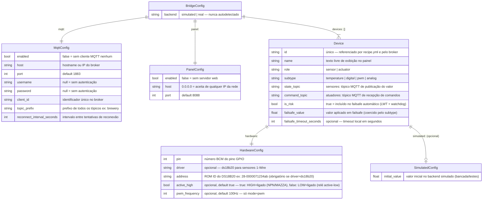
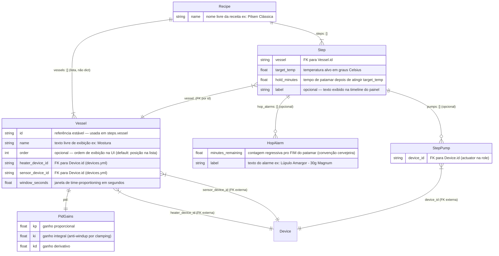
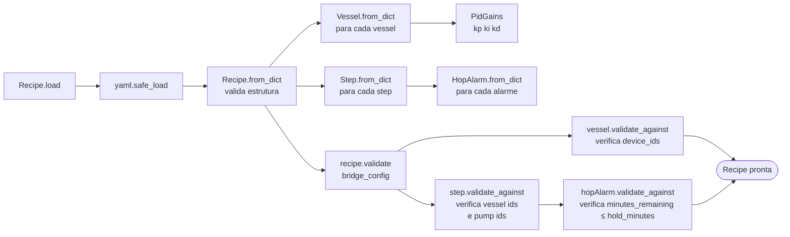
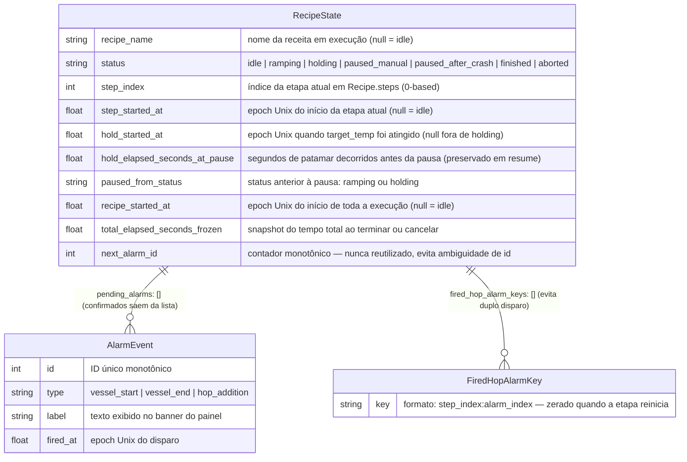
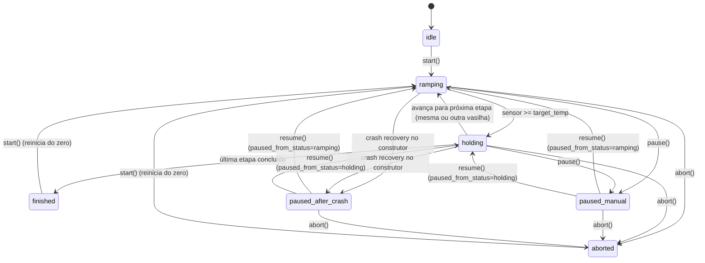

# 04 — Modelo de Dados

> **Navegação:** [Visão Geral](01-visao-geral.md) | [C4 Diagrams](02-diagrama-c4.md) | [Fluxos](03-fluxos.md) | [Casos de Uso](05-casos-de-uso.md) | [Manutenção](06-manutencao-e-expansao.md)

O bridge não usa banco de dados relacional. O estado é mantido em:
- **`devices.yml`** — mapeamento de hardware (editado uma vez, raramente muda)
- **`recipe.yml`** — definição do processo (editado por receita)
- **`recipe_state.json`** — estado de execução em tempo real (escrito pelo bridge a cada transição)

Os diagramas abaixo usam notação ER para explicitar as relações entre entidades.

---

## MER — `devices.yml`



### Regras de validação de `devices.yml`

| Campo | Regra | Erro |
|---|---|---|
| `id` | Único em todo o arquivo | `ConfigError: id duplicado` |
| `pin` | Único, **exceto** quando `driver: ds18b20` + `address` único | `ConfigError: pino duplicado` |
| `address` | Obrigatório quando `driver: ds18b20` | `ConfigError: driver 'ds18b20' requer hardware.address` |
| `active_high` | Deve ser bool (`true`/`false`), **nunca string** (`'false'`) | `ConfigError: deve ser booleano` |
| `failsafe_value` | Coercido pelo `subtype`: `digital`→bool, `pwm`/`temperature`→float | `ConfigError` em tipo incompatível |
| `command_topic` | Obrigatório em `actuator`, proibido em `sensor` | `ConfigError` |
| `state_topic` | Obrigatório em `sensor`, opcional em `actuator` | `ConfigError` |

### active_high: quando usar cada valor

```
MAZZA Handmade (saídas NPN):
  GPIO → Base NPN → HIGH no pino → transistor conduz → relé fecha → carga liga
  active_high: true  ← HIGH = ligado (default, pode omitir)

Módulo relé "azul" do AliExpress (optoacoplador invertido):
  GPIO → Optoacoplador → LOW no pino → relé fecha → carga liga
  active_high: false  ← LOW = ligado
```

---

## MER — `recipe.yml`



### Regras de validação de `recipe.yml`

| Campo | Regra | Erro |
|---|---|---|
| `vessels` | Lista (não dict) — `id` é a chave estável | `RecipeError: campo vessels` |
| `Vessel.id` | Único dentro da receita | `RecipeError: id duplicado` |
| `Step.vessel` | Deve existir em `vessels[].id` | `RecipeError: vessel não declarada` |
| `heater_device_id` | Deve existir em `devices.yml` | `RecipeError: não existe no devices.yml` |
| `sensor_device_id` | Deve existir em `devices.yml` | `RecipeError: não existe no devices.yml` |
| `pumps[]` | Cada id deve existir em `devices.yml` | `RecipeError: pump não existe` |
| `hop_alarm.minutes_remaining` | `≥ 0` e `≤ hold_minutes` | `RecipeError: negativo` ou `nunca dispararia` |

### Ciclo de vida da validação



---

## MER — `recipe_state.json`

Estado de execução persistido em disco. Sobrevive a `kill -9` e quedas de energia. Carregado pelo construtor do `RecipeEngine` na inicialização — se o status for `ramping` ou `holding`, crash recovery é disparado automaticamente.



### Transições de status


