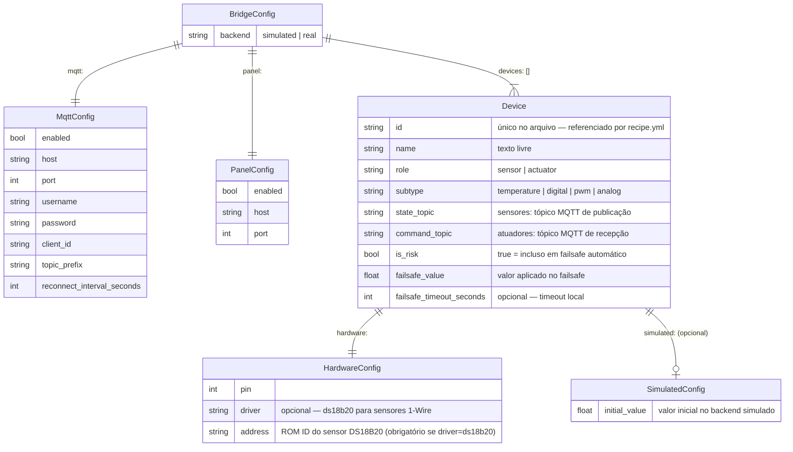
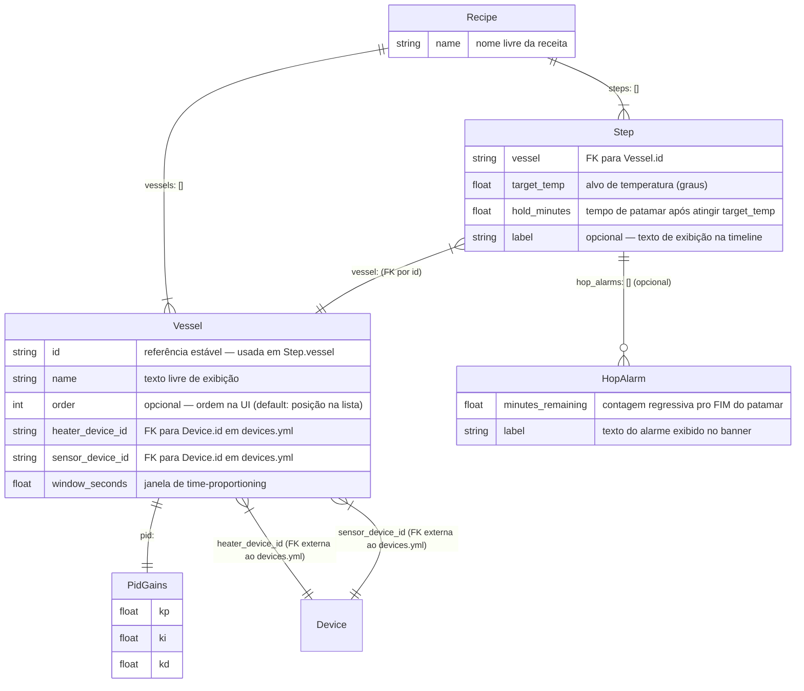
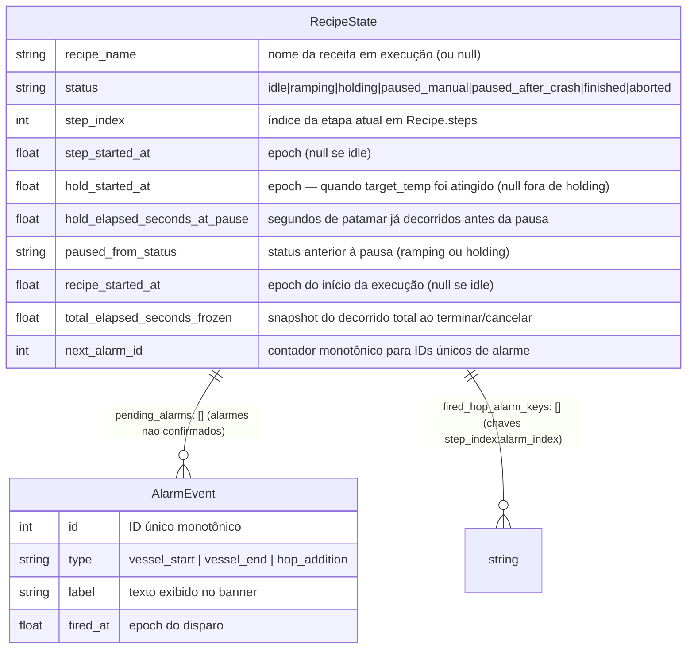

# 04 — Modelo de Dados

O bridge não usa banco de dados relacional — o estado é mantido em dois
arquivos YAML de configuração e um JSON de estado de execução. Os diagramas
abaixo documentam os schemas desses arquivos usando notação ER para
explicitar as relações.

## Schema de `devices.yml`

### Regras de validação de `devices.yml`

| Regra | Detalhe |
|---|---|
| `id` único | Nenhum device pode ter o mesmo `id` — erro de config explícito |
| `pin` duplicado só se `driver: ds18b20` | Múltiplos sensores no mesmo pino 1-Wire são aceitos se cada um tiver `address` único |
| `address` obrigatório com `driver: ds18b20` | Sem `address`, o bridge não consegue distinguir sensores no barramento compartilhado |
| `failsafe_value` do tipo certo | Coercido no load pelo `failsafe_coercion.py` conforme `subtype` — `digital` → bool, `pwm`/`temperature` → float |
| `command_topic` obrigatório em actuators | Sensor não tem `command_topic`; actuator não tem `state_topic` |

---

## Schema de `recipe.yml`

### Regras de validação de `recipe.yml`

| Regra | Detalhe |
|---|---|
| `vessels` é lista, não dict | Espelha convenção de `devices.yml`; `id` é a chave estável |
| `Vessel.id` único | `RecipeError` explícito se duplicado |
| `Step.vessel` deve existir em `vessels` | Validado no `Recipe.load()` |
| `heater_device_id`/`sensor_device_id` devem existir em `devices.yml` | Validação cruzada — falha cedo com mensagem clara |
| `hop_alarm.minutes_remaining <= hold_minutes` | Alarme que nunca dispararia é rejeitado |
| `hop_alarm.minutes_remaining >= 0` | Valor negativo é rejeitado |

---

## Schema de `recipe_state.json`

Estado de execução persistido em disco — sobrevive a `kill -9`.

