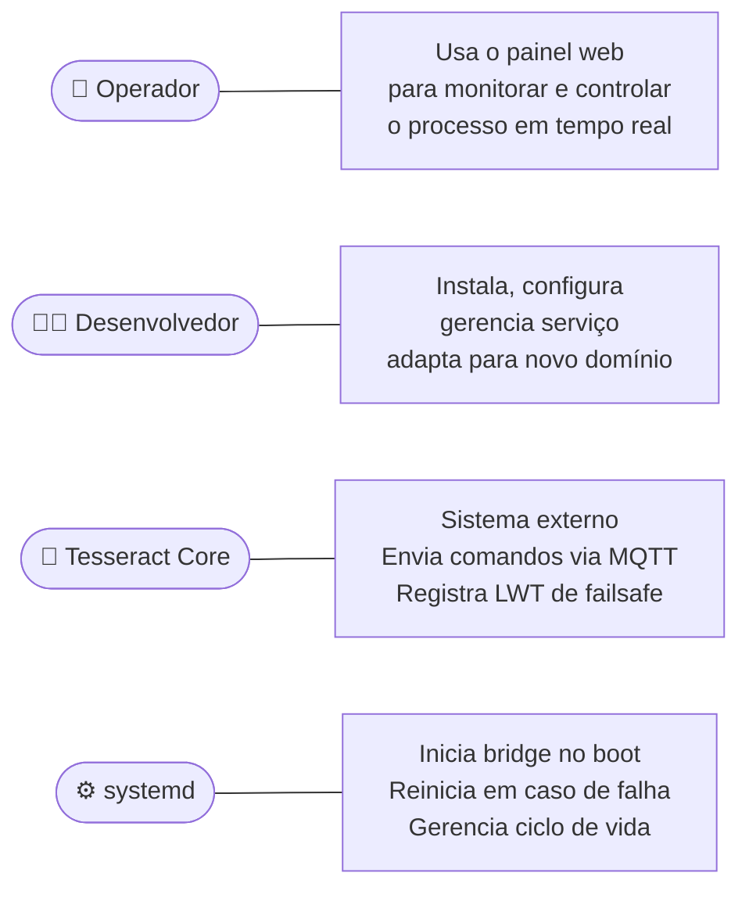
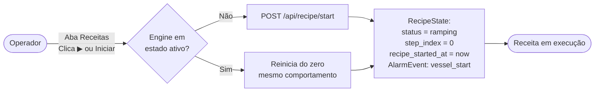
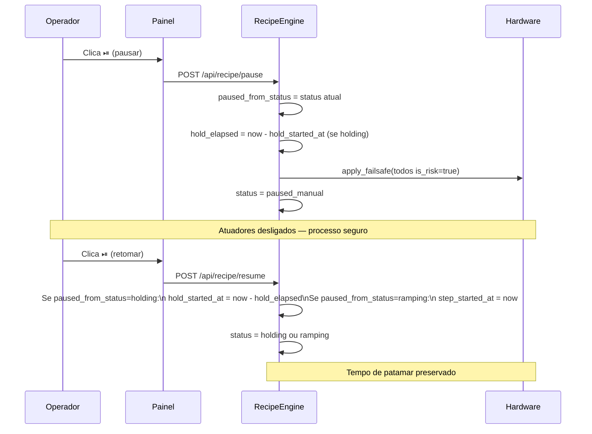
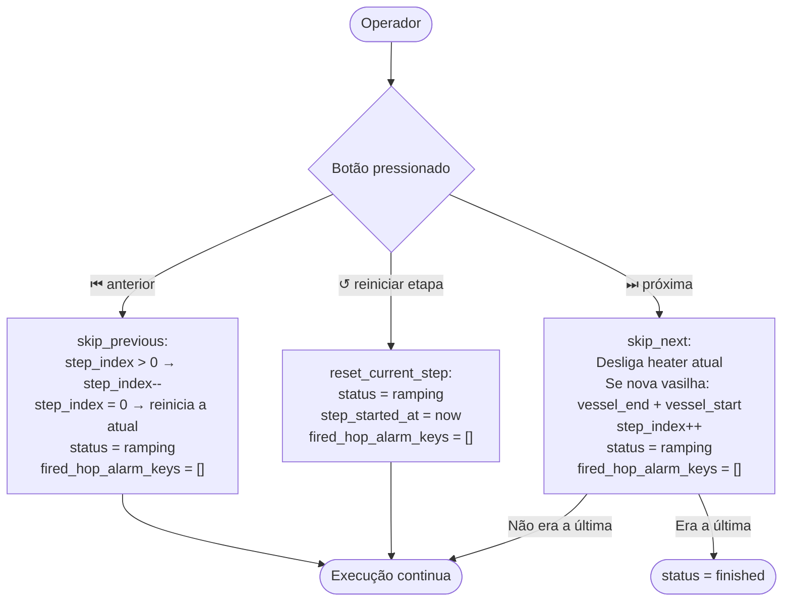
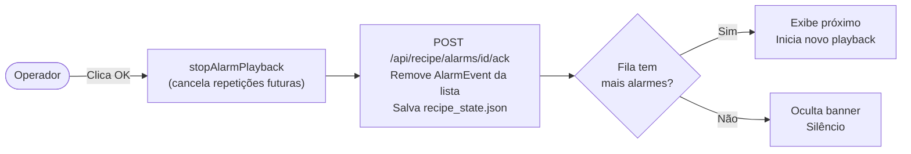
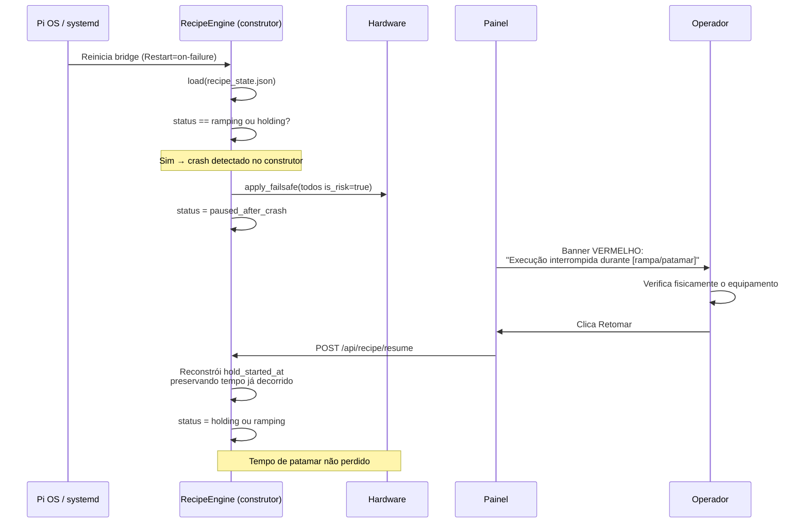
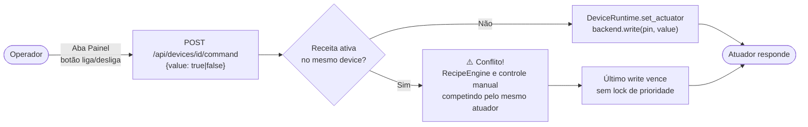
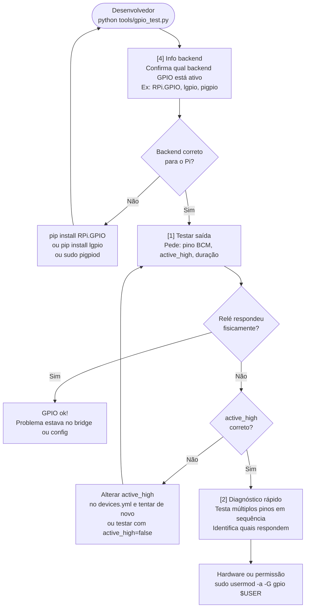
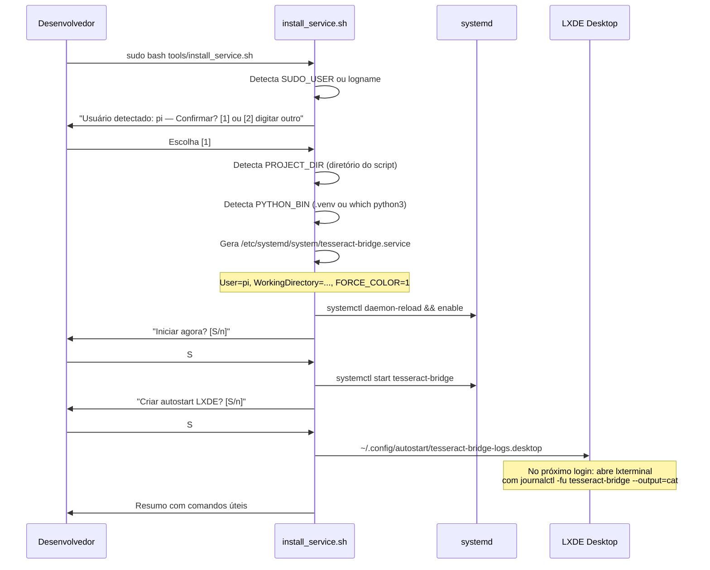
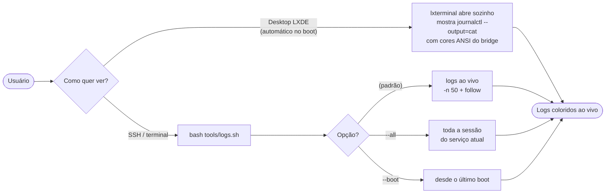

# 05 — Casos de Uso

> **Navegação:** [Visão Geral](01-visao-geral.md) | [C4 Diagrams](02-diagrama-c4.md) | [Fluxos](03-fluxos.md) | [Modelo de Dados](04-modelo-de-dados.md) | [Manutenção](06-manutencao-e-expansao.md)

## Atores

---

## UC01 — Iniciar uma receita

**Ator**: Operador
**Pré-condição**: `recipe.yml` carregado com sucesso no boot; bridge em status `idle`, `finished` ou `aborted`.

**Fluxo alternativo**: Receita já rodando — `start()` interrompe e reinicia do zero (não precisa abortar manualmente antes).

---

## UC02 — Pausar e retomar

**Ator**: Operador
**Pré-condição**: Receita em status `ramping` ou `holding`.

---

## UC03 — Navegar entre etapas manualmente

**Ator**: Operador
**Pré-condição**: Receita em status `ramping` ou `holding`.

---

## UC04 — Confirmar um alarme

**Ator**: Operador
**Pré-condição**: `pending_alarms` não vazio (banner âmbar visível + som tocando).

**Regra de parada do som**: toca pelo número de repetições configurado (1-20) OU para no clique em OK, o que vier primeiro. Token de cancelamento garante que ciclos agendados em `setTimeout` não tocam depois do ack.

---

## UC05 — Cancelar receita

**Ator**: Operador
**Pré-condição**: qualquer status (no-op seguro em `idle`).

| | `abort()` | `pause()` |
|---|---|---|
| Failsafe aplicado | ✅ | ✅ |
| Estado preservado | ❌ (descarta) | ✅ (preserva hold_elapsed) |
| Como retomar | `start()` — reinicia do zero | `resume()` — de onde parou |
| Status final | `aborted` | `paused_manual` |

---

## UC06 — Recuperação após queda de energia

**Ator**: Sistema (automático) + Operador (confirmação)

---

## UC07 — Controlar atuador manualmente

**Ator**: Operador
**Pré-condição**: Device tem `role: actuator`.

**Regra**: Use controle manual só quando a receita não estiver ativa naquele device.

---

## UC08 — Diagnosticar GPIO com gpio_test.py

**Ator**: Desenvolvedor
**Motivação**: isolar se o problema é backend, pino, active_high ou hardware — antes de depurar no bridge completo.

---

## UC09 — Instalar como serviço systemd

**Ator**: Desenvolvedor
**Pré-condição**: bridge instalado e funcionando via `python run_bridge.py`.

---

## UC10 — Ver logs ao vivo

**Ator**: Desenvolvedor / Operador
**Pré-condição**: serviço instalado e rodando.

