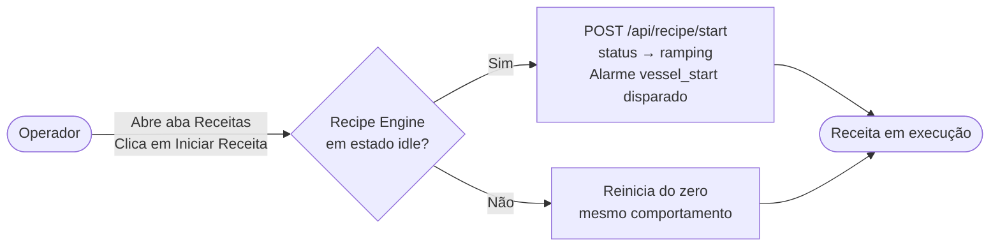
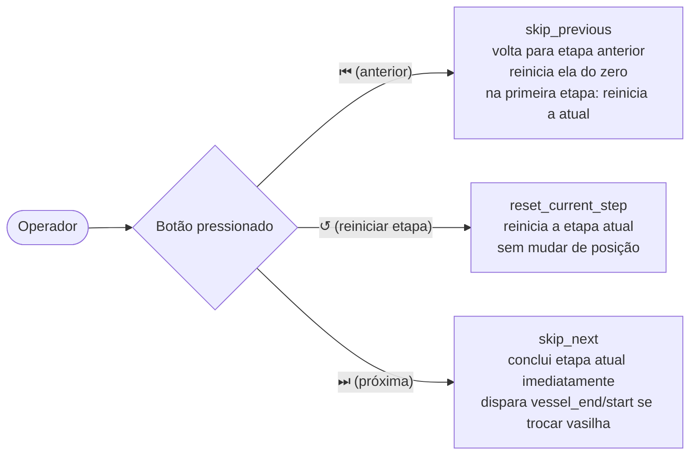
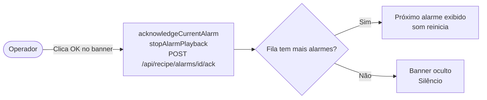

# 05 — Casos de Uso

## Atores

| Ator | Descrição |
|---|---|
| **Operador** | Pessoa que usa o painel web para monitorar e controlar o processo (cervejeiro, agricultor, etc.) |
| **Tesseract Core** | Sistema externo que envia comandos via MQTT e registra o LWT de failsafe |

---

## UC01 — Iniciar uma receita

**Pré-condição**: `recipe.yml` carregado com sucesso no boot (todos os devices referenciados existem no `devices.yml`).
**Fluxo principal**: Operador abre a aba Receitas → clica no botão `▶` (play) na barra de transporte → bridge inicia o PID na primeira vasilha.
**Fluxo alternativo**: Se a receita já estava em andamento, a ação reinicia do zero (mesmo resultado de `abort` seguido de `start`).
**Permissão RBAC**: não aplicável (painel sem autenticação na v1).

---

## UC02 — Pausar e retomar

**Pré-condição**: Receita em status `ramping` ou `holding`.

| Ação | Endpoint | Resultado |
|---|---|---|
| Pausar | `POST /api/recipe/pause` | Aplica failsafe em todos os atuadores `is_risk`, status → `paused_manual` |
| Retomar | `POST /api/recipe/resume` | Reconstrói hold_started_at preservando tempo já decorrido; status → `holding` ou `ramping` |

O botão `⏯` no painel alterna automaticamente entre pausar e retomar conforme o status atual — o operador não precisa saber qual dos dois chamar.

---

## UC03 — Navegar entre etapas manualmente

**Pré-condição**: Receita em status `ramping` ou `holding`.

---

## UC04 — Confirmar um alarme

**Pré-condição**: `pending_alarms` não vazio (banner âmbar visível no painel).

---

## UC05 — Cancelar a receita

**Pré-condição**: qualquer status exceto `idle` (cancelar quando idle é no-op seguro).

**Ação**: `POST /api/recipe/abort` ou botão "Cancelar" no painel.
**Resultado**: Aplica failsafe em todos os atuadores `is_risk`, status → `aborted`, `total_elapsed_seconds` congelado.
**Diferença de pause**: `abort` encerra definitivamente — retomar exige `start` (reinicia do zero). `pause` preserva o estado pra retomar de onde parou.

---

## UC06 — Recuperar de queda de energia

**Ator**: sistema (não é ação do operador — é detectado automaticamente).

**Pré-condição**: Processo caiu com status `ramping` ou `holding` em `recipe_state.json`.
**Gatilho**: Raspberry Pi reinicia, `run_bridge.py` é executado.
**Fluxo automático**:
1. `RecipeEngine.__init__` detecta status ativo em `recipe_state.json`
2. Aplica failsafe em todos os atuadores `is_risk` do `devices.yml`
3. Status → `paused_after_crash`
4. Painel exibe banner vermelho com botão "Retomar"

**Ação do operador**: Confirmar visualmente que o processo pode ser retomado com segurança → clicar "Retomar" → `POST /api/recipe/resume`.

---

## UC07 — Controlar atuador manualmente (fora de receita)

**Pré-condição**: Device é do tipo `actuator`.
**Ação**: `POST /api/devices/<id>/command` com body `{"value": true/false}` ou via botão no painel (aba Painel).
**Conflito conhecido**: se uma receita estiver ativa e o atuador também pertencer à receita, não há lock — os dois podem competir. Usar controle manual só quando a receita não estiver rodando sobre esse device.

---

## UC08 — Adicionar novo domínio de automação

**Ator**: Desenvolvedor (não é o operador cervejeiro).

**Pré-condição**: `devices.yml` descreve o novo hardware (ex.: válvulas de irrigação + sensores de umidade do solo).
**Trabalho necessário**:
1. Escrever `devices.yml` com os devices do novo domínio.
2. Escrever `recipe.yml` com as vasilhas (zonas) e etapas do novo processo.
3. Se o sensor não for DS18B20: implementar um driver novo em `gpio/` seguindo o padrão de `ds18b20_driver.py` + registrar via `register_analog_driver()` no `DeviceRuntime`.
**Trabalho desnecessário**: não tocar em `recipe_engine/`, `bridge.py`, `panel/` nem `mqtt_client.py` — o núcleo é agnóstico de domínio.

Ver detalhes em [06 — Manutenção e Expansão](06-manutencao-e-expansao.md).
