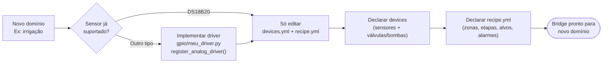

# 06 — Manutenção e Expansão

> **Navegação:** [Visão Geral](01-visao-geral.md) | [C4 Diagrams](02-diagrama-c4.md) | [Fluxos](03-fluxos.md) | [Modelo de Dados](04-modelo-de-dados.md) | [Casos de Uso](05-casos-de-uso.md)

## Armazenamento de receitas (`data/`)

Substituiu o `recipe.yml` único e fixo na raiz. Sem banco de dados —
tudo em arquivo, mesma filosofia de `devices.yml`. Módulo:
`data/__init__.py` (decisão deliberada: lógica direto no `__init__.py`
em vez de um módulo nomeado à parte, diferente do padrão do resto do
projeto — mantido assim por escolha explícita, não repita esse padrão
em outro lugar sem o mesmo motivo).

```
data/
├── public/
│   ├── receita_base.yaml   # migração do antigo recipe.yml — YAML, não passa pelo
│   │                       # sistema de cadastro (não editável via API), mas
│   │                       # sempre selecionável pra brassar
│   └── receita.json        # lista de receitas cadastradas via painel — versionado
└── private/
    └── receita.json        # mesma estrutura, gitignored (.gitignore: data/private/*)
```

**Convenção de "entidade"**: um arquivo JSON por pasta, contendo uma
**lista** de registros — não "um arquivo por receita". `receita` é a
primeira entidade; o par `read_entities(source, entity)` /
`write_entities(source, entity, entries)` é genérico o bastante pra
outros tipos cadastráveis reaproveitarem sem duplicar a parte de I/O.

**Id global de uma receita**: `"{source}:{id}"` (ex.: `"public:base"`
pra receita_base, `"private:3fa85f64-..."` pra uma entrada de
`receita.json`) — evita colisão entre uma receita pública e uma
privada com o mesmo id local, sem precisar de nenhum registro central.

**Resolução da receita ativa no boot** (`load_active_recipe()`,
chamada por `run_bridge.py` quando nenhum path é passado explicitamente
via CLI), nesta ordem:

1. Ponteiro salvo (`data/active_recipe.txt`, gitignored — escolha de
   operação local, não configuração do projeto). Se apontar pra algo
   que sumiu ou ficou inválido, loga aviso e cai pro próximo nível —
   nunca derruba o motor de receita por causa de um ponteiro velho.
2. `data/public/receita_base.yaml`, se existir.
3. `recipe.yml` na raiz do projeto — **fallback legado**, preservado
   só pra quem ainda não migrou pra `data/` não quebrar.
4. `None` — motor de receita desabilitado (mesmo comportamento de
   sempre quando não há nenhuma receita configurada).

**Troca de receita ativa exige reiniciar o processo** (decisão
registrada) — `POST /api/recipes/active` só grava o ponteiro pro
próximo boot, nunca troca o `RecipeEngine` em memória agora. Trocar
isso pra "a quente" (sem restart) é trabalho futuro, ver `BACKLOG.md`.

**Reaproveitamento de validação**: `Recipe.from_dict(raw)` +
`recipe.validate(bridge_config)` (já existiam separados de
`Recipe.load()`, que só os combina com leitura de arquivo YAML) são o
que permite ler uma receita de dentro de um registro de
`receita.json` (JSON, não YAML) sem duplicar nenhuma validação —
`data.load_recipe_by_id()` chama exatamente esses dois métodos.

**Tela de cadastro pelo painel ainda não existe** — este trabalho foi
só a fundação (armazenamento + descoberta + resolução + `GET /api/recipes`
+ `POST /api/recipes/active`). Editar `receita.json` hoje é manual.

## Prioridade de controle: dono único do GPIO por atuador

`DeviceRuntime` é o dono único da escrita física em qualquer atuador
que o `RecipeEngine` também controla — nem o motor de receita nem o
painel escrevem direto no GPIO desses devices, os dois só *pedem*
(`set_pid_duty`/`set_manual_duty_percent`+`set_manual_enabled` pra
heaters; `_apply_pumps`/`set_manual_override` pra bombas).

**Achado real que motivou isso**: `RecipeEngine._apply_pumps()` decidia
liga/desliga comparando a lista de pumps da etapa atual contra seu
**próprio bookkeeping interno** (`self._active_pumps`), nunca contra o
estado físico real. Sem `has_manual_override()`, um comando manual
numa bomba era desfeito silenciosamente na próxima troca de etapa —
sem erro, sem aviso. Ver [Fluxo 8](03-fluxos.md#fluxo-8--prioridade-de-controle-de-um-atuador-failsafe--manual--receita--repouso)
pro diagrama completo de prioridade (failsafe > manual > receita >
repouso) e a tabela de qual método cada camada chama.

Ao adicionar qualquer automação nova que controle um atuador também
exposto ao painel: **nunca escrever direto via `backend.write()`** —
sempre passar por `DeviceRuntime` e checar/registrar override, ou o
mesmo tipo de dessincronização volta a acontecer.

**Confirmação de acionamento automático de bomba** (camada extra, só
pra bombas): a receita nunca liga uma bomba pela primeira vez nesta
execução sem aprovação explícita do operador — ver
[Fluxo 9](03-fluxos.md#fluxo-9--confirmação-de-acionamento-automático-de-bomba-só-bombas-não-heaters).
Deliberadamente implementado com bookkeeping próprio
(`_confirmed_pumps`/`_pending_confirmation`, `RecipeEngine`) em vez de
estender `has_manual_override()` — são conceitos diferentes: override
é "a receita nunca controla isto", confirmação pendente é "a receita
vai controlar, só ainda não teve aprovação pra começar". Se algum dia
o mesmo padrão fizer sentido pra heater (ex.: primeira vez ligando uma
resistência nova instalada), o lugar certo é generalizar esse
mecanismo em `DeviceRuntime`, não duplicar em `RecipeEngine`.

## Adicionar um novo tipo de sensor analógico

O único driver analógico implementado é o DS18B20 (temperatura 1-Wire). Para suportar outro tipo (umidade do solo, pH, CO2, pressão, etc.):

**1. Criar o driver em `gpio/<nome>_driver.py`:**

```python
class MeuSensorReader:
    """
    Driver para [descrever o sensor].
    Recebe os mesmos kwargs do bloco hardware: do devices.yml — ignore
    os que não usar com **kwargs para manter compatibilidade futura.
    """
    def __init__(self, pin: int, address: str | None = None, **kwargs):
        self.pin = pin
        self.address = address
        # inicializar comunicação i2c, SPI, filesystem, etc.

    @property
    def value(self) -> float:
        # lógica de leitura — retorna float
        return 0.0
```

**2. Registrar no `DeviceRuntime` (ou no `run_bridge.py`):**

```python
from gpio.real_backend import register_analog_driver
from gpio.meu_sensor_driver import MeuSensorReader
register_analog_driver("meu_sensor", MeuSensorReader)
```

**3. Usar em `devices.yml`:**

```yaml
- id: sensor_umidade
  role: sensor
  subtype: temperature  # use o subtype mais próximo
  hardware:
    pin: 5
    driver: meu_sensor
    address: "opcional"
```

**4. Adicionar testes** em `tests/test_meu_sensor_driver.py` com filesystem fake ou mock (ver `tests/test_ds18b20_driver.py` como referência — usa `tmp_path` com arquivo `w1_slave` fake, sem precisar de hardware real).

> **Sensor lento (I²C, SPI, conversão com delay)?** Não bloqueie `.value` — sem cache, cada `/api/devices` do painel travaria pelo tempo de leitura do sensor multiplicado pela quantidade deles. `gpio/ds18b20_driver.py` (`Ds18b20Reader`) já resolve isso com o padrão "thread de fundo + cache contínuo": primeira leitura síncrona só no `__init__` (uma vez, no boot), depois uma thread dedicada mantém `.value` sempre atualizado sem nunca bloquear quem chama. Reaproveite o mesmo padrão (inclusive `close()` via `hasattr(device, "close")`, já genérico em `RealGPIOBackend.teardown()`) em vez de reinventar.

---

## Adaptar para um novo domínio de automação

O bridge é agnóstico de domínio. Para controlar irrigação por zona, estufa, tanque de fermentação, etc.:



**O que muda:**

| Arquivo | O que fazer |
|---|---|
| `devices.yml` | Mapear sensores e atuadores do novo hardware |
| `recipe.yml` | Definir as "vasilhas" (zonas/compartimentos) e as etapas do processo |
| `gpio/<driver>.py` | Apenas se o sensor não for DS18B20 |

**O que não muda (nunca):**
`recipe_engine/`, `bridge.py`, `panel/`, `mqtt_client.py`, `failsafe_watchdog.py`, `status_handler.py` — o núcleo opera sobre abstrações genéricas.

**Limitação pendente**: o campo de alvo se chama `target_temp` (legado cervejeiro). Para renomear sem quebrar receitas existentes: adicionar `target_value` como alias, manter `target_temp` com `DeprecationWarning`.

---

## Trocar ou forçar o backend GPIO

O `_pick_pin_factory()` em `gpio/real_backend.py` tenta lgpio → RPi.GPIO → pigpio nessa ordem. Para forçar um específico:

```python
# No run_bridge.py ou run_panel.py, antes de criar o DeviceRuntime:
from gpiozero.pins.rpigpio import RPiGPIOFactory
from gpio.real_backend import RealGPIOBackend

backend = RealGPIOBackend(pin_factory=RPiGPIOFactory())
```

Ou instale só o pacote do backend que quer que seja escolhido automaticamente:

| Quer usar | Comando |
|---|---|
| RPi.GPIO (Raspbian/Bullseye) | `pip install RPi.GPIO` |
| lgpio (Bookworm/Pi 5) | `pip install lgpio` |
| pigpio (qualquer) | `pip install pigpio && sudo pigpiod` |

Se nenhum estiver instalado e o gpiozero não conseguir abrir o GPIO, o erro aparece na primeira chamada a `setup()`, não no import — o bridge vai iniciar mas falhar ao configurar o primeiro device real.

---

## Configurar active_high para relé active-low

```yaml
# devices.yml — exemplo com módulo de relé active-low (optoacoplador invertido):
- id: meu_rele
  role: actuator
  subtype: digital
  hardware:
    pin: 17
    active_high: false   # LOW no pino = relé fecha = carga liga
```

Sem esse campo (default `true`): HIGH no pino = atuador liga. Correto para a MAZZA e para a maioria dos relés industriais com transistor NPN.

Cuidado: `active_high: 'false'` (com aspas) é um erro — o YAML vai interpretar como string e o `config.py` vai levantar `ConfigError` com mensagem clara.

---

## Gerenciar o serviço systemd

```bash
# Instalar (primeira vez):
sudo bash tools/install_service.sh

# Operação:
sudo systemctl status tesseract-bridge    # status atual
sudo systemctl start  tesseract-bridge    # iniciar
sudo systemctl stop   tesseract-bridge    # parar
sudo systemctl restart tesseract-bridge   # reiniciar (após mudar devices.yml ou uma receita em data/)
sudo systemctl enable  tesseract-bridge   # habilitar no boot
sudo systemctl disable tesseract-bridge   # desabilitar do boot

# Logs:
bash tools/logs.sh           # ao vivo (CTRL+C para parar)
bash tools/logs.sh --all     # toda a sessão atual
bash tools/logs.sh --boot    # desde o último boot
sudo journalctl -fu tesseract-bridge      # equivalente direto

# Remover:
sudo bash tools/uninstall_service.sh
```

Após editar `devices.yml` ou uma receita em `data/`, é necessário reiniciar o serviço — o bridge carrega as configurações apenas no boot do processo.

---

## Adicionar um novo campo ao schema

**Em `devices.yml` (`config.py`):**
1. Adicionar no dataclass `Device` (ou `HardwareConfig` se for campo de hardware) com default.
2. Adicionar validação em `Device.validate()` se necessário.
3. Propagar em `device_runtime.py` (bloco de kwargs passado ao `backend.setup()`).
4. Adicionar testes em `tests/test_config.py`.
5. Atualizar `devices.yml.example` e este arquivo (`06`) + `04-modelo-de-dados.md`.

**Em `recipe.yml` (`recipe_engine/models.py`):**
Mesma sequência, com `recipe_engine/models.py` + `tests/test_recipe_models.py`.

⚠️ **`recipe_state.json`**: `RecipeState.load()` usa `dataclass(**raw)` — campos novos sem default quebram o load de estados antigos. **Sempre use `field(default=...)`**.

---

## Pontos de extensão conhecidos

| Ponto | Arquivo | Como usar |
|---|---|---|
| `register_analog_driver(name, fn)` | `gpio/real_backend.py` | Registra novos drivers de sensor analógico |
| `RealGPIOBackend(pin_factory=...)` | `gpio/real_backend.py` | Injeta backend específico (testes / forçar lgpio etc.) |
| `GPIOBackend` (ABC) | `gpio/base.py` | Subclassar para backends totalmente novos (I²C, serial, etc.) |
| `BridgeConfig.mqtt.enabled: false` | `devices.yml` | Bridge 100% offline sem broker |
| `FORCE_COLOR=1` | env | Ativa cores nos logs mesmo sem TTY (serviço systemd) |
| `NO_COLOR=1` | env | Desativa cores (redirect para arquivo, CI, etc.) |
| `AlarmEvent.type` | `recipe_engine/state.py` | String livre — adicionar novos tipos sem mudar UI |
| Polling 2.5s | `panel/templates/index.html` | `setInterval(pollRecipeStatus, 2500)` — ajustável |
| `has_manual_override(id)` / `set_manual_override(id, valor)` | `device_runtime.py` | Registra override manual pra qualquer atuador sem controle de potência — `RecipeEngine._apply_pumps()` já respeita |
| `confirm_pump_auto(id)` / `decline_pump_auto(id)` | `recipe_engine/engine.py` | Resolve uma bomba pendente de confirmação — usado pelo painel, mas chamável direto em teste/script |
| `hardware.poll_interval_seconds` / `stale_after_seconds` | `devices.yml` (por sensor `ds18b20`) | Ajusta o intervalo da thread de fundo e o limite de "sensor desconectado" — ver [Ds18b20Reader](../../gpio/ds18b20_driver.py) |

---

## Checklist de deploy em Pi real

### Antes de trocar para `backend: real`

- [ ] `python tools/gpio_test.py` → opção `[4]` confirma qual backend GPIO está ativo
- [ ] `python tools/gpio_test.py` → opção `[2]` testa cada pino da MAZZA (17, 27, 22, 26) — cada relé deve responder visualmente
- [ ] `python -m gpio.ds18b20_scan` → endereços dos sensores encontrados e anotados
- [ ] `data/public/devices.yml` com os endereços reais (`28-xxxxxx`) nos campos `address`

### Antes de usar na brassagem

- [ ] `python -m pytest tests/ -v` → 393+ testes passando
- [ ] `data/public/devices.yml` com `backend: real` (não `simulated`)
- [ ] `mqtt.host` correto (ou `mqtt.enabled: false`)
- [ ] Receita validada: `python3 -c "from config import BridgeConfig; import data; config=BridgeConfig.load('data/public/devices.yml'); recipe=data.load_active_recipe(config); print('OK:', recipe.name, recipe.step_count(), 'etapas')"`
- [ ] Testar failsafe: `kill -9 <pid>` durante execução → confirmar que relés desligam ao reiniciar
- [ ] Serviço instalado e auto-start verificado: `sudo systemctl enable tesseract-bridge`
- [ ] Autostart LXDE verificado: lxterminal abre com logs no boot do desktop
